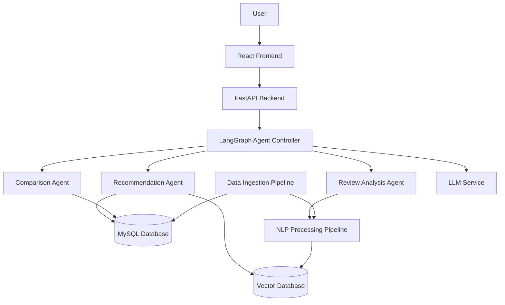
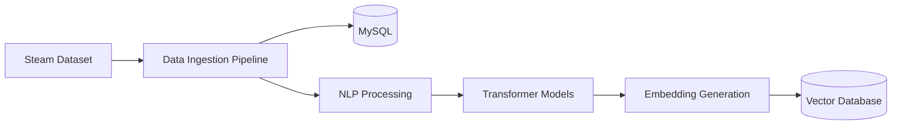
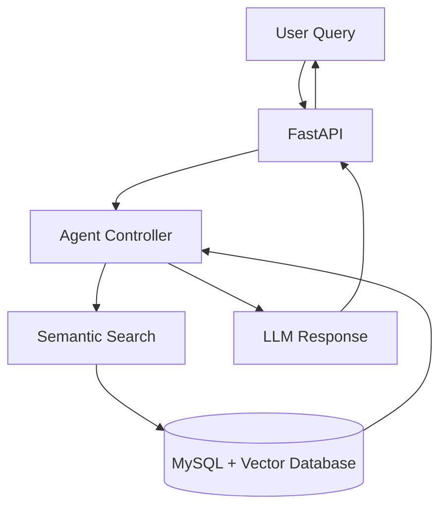
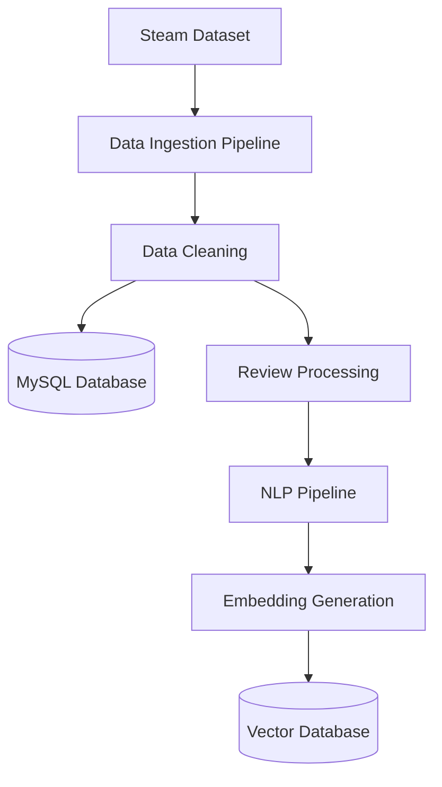
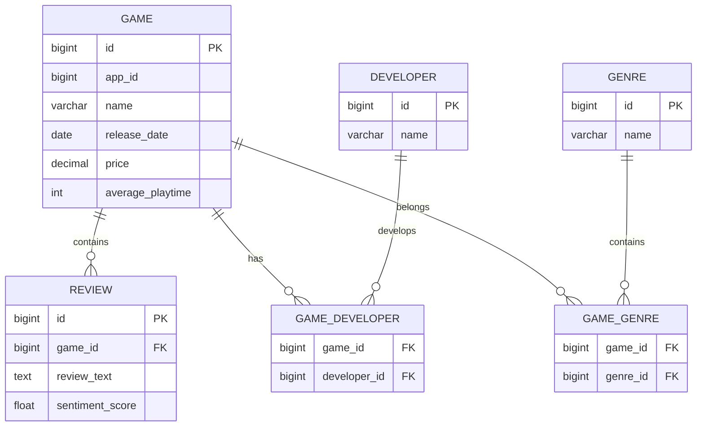
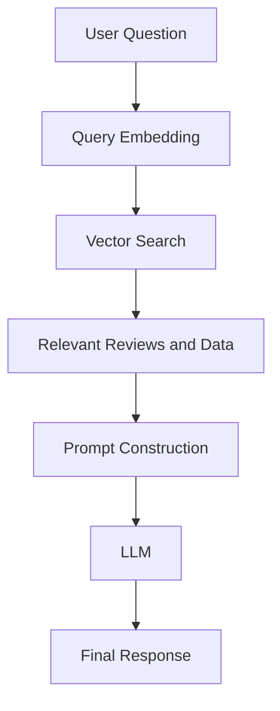
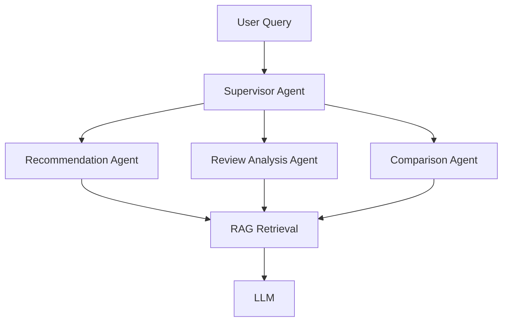
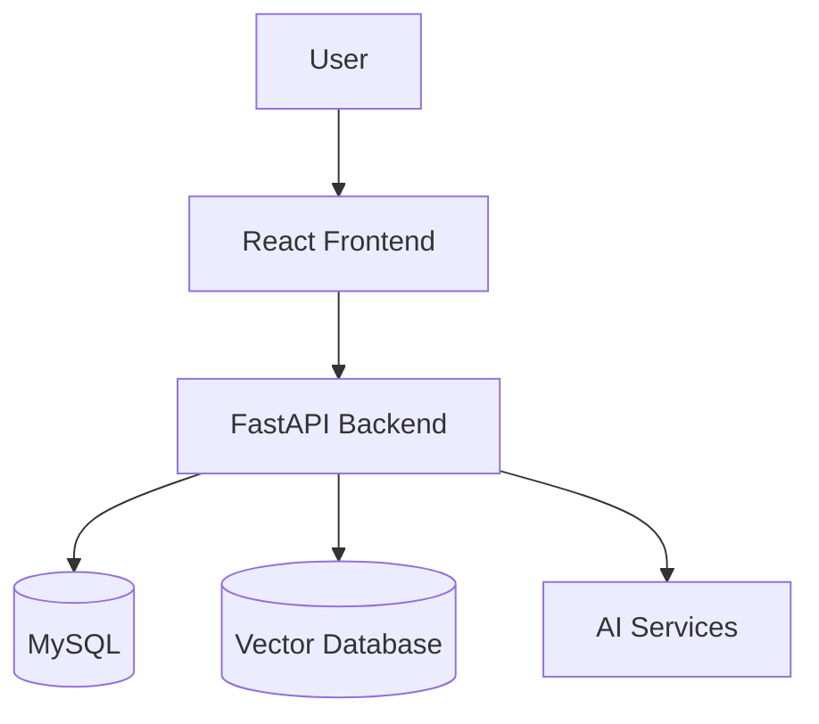

# Arcademia AI
## Agentic Game Intelligence Platform

# Software Design Document

Version: 1.0

---

# 1. Introduction

## 1.1 Document Purpose

This document explains the design and architecture of Arcademia AI, an AI-powered game intelligence platform built on top of Steam game data.

The purpose of this document is to describe the system requirements, architecture decisions, data flow, and responsibilities of different components.

The document is written to make the system easy to understand, maintain, and extend.

---

# 2. Problem Statement

The gaming ecosystem contains a large amount of information about games, including game metadata, player reviews, ratings, genres, popularity metrics, and community feedback.

Finding useful information from this data is difficult because traditional search systems mainly depend on exact keyword matching.

For example, a user may ask:

```
Suggest games similar to Elden Ring but with a stronger story.

Why do players complain about Cyberpunk 2077?

Compare Witcher 3 and Skyrim based on player experience.
```

These questions require understanding the meaning behind the query, not only matching keywords.

Arcademia AI solves this problem by combining structured data analysis, Natural Language Processing, transformer-based models, semantic search, Retrieval-Augmented Generation (RAG), and agent-based workflows.

The goal is to create a system that can understand games and player opinions instead of only storing and displaying game information.

---

# 3. Project Overview

Arcademia AI is an intelligent game analysis platform that processes Steam game information and user reviews to provide meaningful insights.

The system uses two types of data:

1. Structured data such as game information, genres, ratings, developers, pricing, and popularity metrics.

2. Unstructured text data such as player reviews, which contains opinions, experiences, and feedback.

The platform provides capabilities such as:

- Natural language game search
- Game recommendation
- Review sentiment analysis
- Game comparison
- Player feedback analysis
- AI-powered question answering

The system is designed using separate layers so that individual components can be improved or replaced without affecting the complete application.

---

# 4. Data Source

Arcademia AI uses the Steam Games Dataset available from Kaggle.

The dataset contains metadata for more than 136,000 Steam games collected from public sources through an automated data pipeline.

The dataset contains two main files:

- `steam_games.csv`
- `steam_games_reviews.csv`

---

## 4.1 steam_games.csv

This file contains structured information about Steam games.

Important fields include:

| Column | Description |
|---|---|
| app_id | Unique Steam application identifier |
| name | Game title |
| release_date | Game release date |
| price | Current game price |
| estimated_owners | Estimated ownership range |
| developers | Game developers |
| publishers | Game publishers |
| genres | Game genres |
| categories | Steam categories such as single-player and co-op |
| positive | Number of positive reviews |
| negative | Number of negative reviews |
| recommendations | Number of user recommendations |
| average_playtime_forever | Average total playtime |
| steam_store_available | Indicates Steam Store data availability |
| steam_spy_available | Indicates SteamSpy data availability |

This data is used for structured search, filtering, recommendations, and game analytics.

---

## 4.2 steam_games_reviews.csv

This file contains user review information.

Each record contains:

| Column | Description |
|---|---|
| app_id | Steam application identifier |
| name | Game title |
| reviews | JSON document containing English user reviews |

The two datasets are connected using:

```
steam_games.app_id = steam_games_reviews.app_id
```

The review data is used for NLP processing tasks such as sentiment analysis, topic extraction, semantic search, and RAG-based responses.

---

# 5. Project Goals

The main goal of Arcademia AI is to build a system that can understand game information and player feedback.

The platform focuses on the following areas:

## Game Understanding

The system should understand game characteristics such as genre, popularity, ratings, player engagement, and common review patterns.

## Player Feedback Analysis

The system should process user reviews to identify common positive and negative opinions about games.

Examples:

- Gameplay quality
- Performance issues
- Story experience
- Difficulty level
- Multiplayer experience

## Intelligent Search and Recommendations

Users should be able to search using natural language instead of only game names or filters.

For example:

```
Find games with strong storytelling and exploration.
```

The system should understand the intent and return relevant results.

## AI-based Question Answering

The platform should answer questions by retrieving relevant game information and generating responses based on available data.

---

# 6. Scope

## 6.1 Included Scope

The first version of Arcademia AI includes:

- Loading and processing Steam dataset
- Storing structured game information
- Processing game reviews using NLP models
- Generating text embeddings
- Semantic search
- Sentiment analysis
- AI-powered game analysis
- Agent-based workflows for different user requests

---

## 6.2 Out of Scope

The initial version will not include:

- Real-time Steam data synchronization
- User accounts and authentication
- Online multiplayer features
- Game purchasing
- Financial prediction
- Predicting future game success

These can be considered future improvements.

---

# 7. Functional Requirements

## 7.1 Game Search

The system should allow users to search games using both traditional filters and natural language queries.

Example:

```
Find multiplayer survival games with positive reviews.
```

The system should understand the meaning of the query and retrieve relevant games.

---

## 7.2 Game Recommendation

The system should recommend games based on:

- Similar game characteristics
- Genre similarity
- Player feedback
- Review patterns

The recommendation should also explain why a game was recommended.

---

## 7.3 Review Analysis

The system should analyze player reviews and identify overall feedback.

The analysis should provide information such as:

- Positive aspects
- Common complaints
- Frequently discussed topics
- Player sentiment

---

## 7.4 Game Comparison

Users should be able to compare two games.

The comparison should consider:

- Game metadata
- Ratings
- Review sentiment
- Player opinions

---

## 7.5 AI Question Answering

Users should be able to ask questions about games in natural language.

Example:

```
Why do players like Hades?

What are the common problems reported for this game?
```

The system should retrieve relevant information and generate an answer using the AI pipeline.

---

# 8. Non Functional Requirements

## Performance

The system should provide responses within acceptable time limits.

To achieve this:

- Database queries should use proper indexing.
- Vector search should retrieve only relevant documents.
- Expensive NLP processing should happen during data processing instead of during user requests.

---

## Maintainability

The system should follow clear separation of responsibilities.

The following components should remain independent:

- API layer
- Business logic
- Database layer
- NLP pipeline
- AI agent workflows

This allows future changes without affecting the entire system.

---

## Reliability

The system should handle failures gracefully.

Examples:

- Missing dataset values
- Database connection failures
- AI service failures
- Invalid user queries

The application should return meaningful errors instead of failing completely.

---

## Scalability

The system should support future growth.

Possible future changes:

- More games
- More reviews
- New AI models
- Additional analysis agents
- Real-time data ingestion

---

# 9. System Design Approach

The system is divided into multiple layers based on responsibility.

This separation keeps the design simple and allows individual components to evolve independently.

The major layers are:

```
+----------------------+
|    Client Layer      |
| React Application    |
+----------+-----------+
           |
           |
+----------v-----------+
| Application Layer    |
| FastAPI Backend      |
+----------+-----------+
           |
           |
+----------v-----------+
| AI Processing Layer  |
| NLP + RAG + Agents   |
+----------+-----------+
           |
           |
+----------v-----------+
| Data Layer           |
| MySQL + Vector DB    |
+----------------------+
```

---

# 10. High Level Design (HLD)

## 10.1 System Architecture



---

# 10.2 Component Overview

## Frontend Layer

The frontend provides the interface through which users interact with Arcademia AI.

Responsibilities:

- Accept user queries
- Display game information
- Display AI-generated insights
- Show recommendations and comparisons

Technology:

- React
- Tailwind CSS

---

## FastAPI Backend

The backend acts as the main application layer.

Responsibilities:

- Receive user requests
- Validate input
- Communicate with AI workflows
- Return responses

The backend does not contain AI model logic directly. AI processing is kept separate for better maintainability.

---

## Data Ingestion Pipeline

The ingestion layer processes raw dataset files.

Responsibilities:

- Read Steam dataset files
- Clean missing or inconsistent values
- Transform data into application format
- Store structured data in MySQL
- Send review text for NLP processing

The dataset is treated as an input source, not as the application's runtime storage.

---

## MySQL Database

MySQL stores structured application data.

Examples:

- Games
- Developers
- Genres
- Ratings
- Statistics
- Processed metadata

MySQL is used because the dataset contains clear relationships between different entities.

---

## NLP Processing Pipeline

The NLP pipeline processes review text.

Responsibilities:

- Text cleaning
- Sentiment analysis
- Topic extraction
- Entity extraction
- Embedding generation

Transformer-based models are used for understanding text meaning.

---

## Vector Database

The vector database stores generated embeddings.

It is responsible for semantic search.

Example:

A user searches:

```
Games with emotional storytelling
```

The vector database can find reviews and games with similar meaning even if the exact words are not present.

---

## Agent Controller

The agent controller manages AI workflows.

It decides which analysis process should handle a user request.

Example:

A recommendation question is sent to the Recommendation Agent.

A review-related question is sent to the Review Analysis Agent.

---

# 11. Data Flow

## Data Processing Flow



---

## User Request Flow



---

# 12. Data Architecture

Arcademia AI works with two different types of data:

1. Structured data
2. Unstructured text data

Both types of data require different storage and processing approaches.

Structured data is stored in MySQL because it contains clear relationships between entities such as games, developers, genres, and ratings.

Unstructured review text is processed using NLP models and stored as embeddings in a vector database for semantic search.

The overall data architecture is:



---

# 13. Data Ingestion Pipeline

The data ingestion pipeline is responsible for converting raw dataset files into application-ready data.

The pipeline performs the following steps:

1. Read dataset files.
2. Validate the data.
3. Remove invalid or incomplete records.
4. Transform the data into required formats.
5. Store structured information in MySQL.
6. Send review text for NLP processing.

The ingestion process is separated from the application layer because data loading should not affect normal user requests.

---

## 13.1 Data Processing Flow

```text
Raw CSV Data

      |
      v

Data Validation

      |
      v

Data Cleaning

      |
      +----------------+
      |                |
      v                v

Game Data        Review Data

      |                |
      v                v

MySQL Storage    NLP Processing
```

---

## 13.2 Handling Data Quality Issues

Real datasets often contain incomplete or inconsistent data.

Examples:

- Missing game descriptions
- Missing developer names
- Empty reviews
- Duplicate records
- Invalid dates

The system handles these cases by:

- Validating required fields before storage.
- Ignoring duplicate records.
- Storing missing values as NULL.
- Logging invalid records for review.
- Continuing processing instead of failing completely.

---

# 14. MySQL Database Design

MySQL stores structured information required by the application.

The database follows a relational design because games have relationships with developers, publishers, genres, and reviews.

---

# 14.1 Entity Relationship Overview



---

# 14.2 Game Table

Stores basic information about games.

```sql
Game

id
app_id
name
release_date
price
average_playtime
positive_reviews
negative_reviews
recommendations
created_at
updated_at
```

Responsibilities:

- Store game metadata.
- Provide information for search and recommendations.

---

# 14.3 Developer Table

Stores developer information.

```sql
Developer

id
name
```

Keeping developers separate avoids repeating the same developer information for multiple games.

---

# 14.4 Genre Table

Stores game genres.

```sql
Genre

id
name
```

A separate table allows one game to belong to multiple genres.

Example:

```
Game:
The Witcher 3

Genres:
- RPG
- Adventure
- Open World
```

---

# 14.5 Review Table

Stores processed user reviews.

```sql
Review

id
game_id
review_text
sentiment_score
sentiment_label
created_at
```

The raw review is stored for reference.

The processed sentiment values are stored to avoid running NLP models repeatedly.

---

# 14.6 Database Indexing Strategy

Indexes are added for frequently searched fields.

Examples:

Game search:

```sql
INDEX(name)
```

Filtering by popularity:

```sql
INDEX(recommendations)
```

Finding reviews for a game:

```sql
INDEX(game_id)
```

The purpose of indexing is to reduce query time when the dataset grows.

---

# 15. NLP Pipeline Design

The NLP pipeline converts user reviews into meaningful information.

The pipeline does not train models from scratch.

It uses existing transformer-based models and focuses on applying them effectively.

The pipeline contains:

1. Text preprocessing
2. Sentiment analysis
3. Topic extraction
4. Embedding generation

---

# 15.1 Text Processing

Before sending text to models, reviews are cleaned.

Steps include:

- Removing unnecessary symbols
- Removing duplicate spaces
- Handling empty reviews
- Normalizing text format

Example:

Before:

```
THIS GAME IS AMAZING!!!! 100% recommended!!!
```

After:

```
this game is amazing recommended
```

---

# 15.2 Sentiment Analysis

Sentiment analysis identifies the overall opinion of players.

Example:

Review:

```
The gameplay is amazing but the game crashes frequently.
```

Possible output:

```
Positive:
Gameplay

Negative:
Performance issues

Overall:
Mixed sentiment
```

A transformer-based classification model is used for this task.

The sentiment result is stored in MySQL so repeated analysis is avoided.

---

# 15.3 Topic Extraction

Topic extraction identifies common discussion areas in reviews.

Examples:

Input reviews:

```
The story is excellent.

Combat feels satisfying.

The game performance is poor.
```

Extracted topics:

```
Story
Combat
Performance
```

These topics help users understand common player opinions.

---

# 15.4 Named Entity Extraction

Named Entity Recognition can identify important entities from text.

Examples:

Review:

```
Cyberpunk 2077 has amazing visuals but poor optimization.
```

Extract:

```
Game:
Cyberpunk 2077

Topic:
Optimization
```

This information can improve search and analysis.

---

# 16. Transformer Model Usage

Arcademia AI uses transformer models because traditional keyword-based methods cannot understand the meaning of text.

The system uses pretrained models for:

- Text classification
- Sentiment analysis
- Embedding generation

No model training is required during the initial version.

---

## 16.1 Why Transformers?

Traditional methods:

```
"great story"

"excellent narrative"
```

are treated as different words.

Transformer models understand that both sentences have similar meanings.

This improves:

- Search accuracy
- Recommendation quality
- Review analysis

---

# 16.2 Embedding Generation

Embeddings convert text into numerical representations.

Example:

```
"The game has an amazing story"
```

becomes:

```
[0.24, 0.71, 0.15, ....]
```

The numbers represent the meaning of the sentence.

Similar sentences produce similar vectors.

These vectors are stored in the vector database.

---

# 17. Vector Database Design

The vector database stores embeddings created from:

- Game descriptions
- Reviews
- Extracted topics

The vector database is used for semantic search.

---

## 17.1 Semantic Search Example

User query:

```
Games with emotional stories and memorable characters
```

Keyword search may fail because the exact words may not exist.

Semantic search finds:

```
Game A:
"The story creates a strong emotional connection with players."

Game B:
"Characters are deeply written and memorable."
```

because the meaning is similar.

---

## 17.2 Vector Data Structure

Example:

```
Vector Document

id:
review_12345

content:
"The story and characters are excellent."

metadata:

{
 game_id: 500,
 game_name: "Game Name",
 genre: "RPG"
}

embedding:

[0.23,0.54,0.89,...]
```

---

# 18. Retrieval-Augmented Generation (RAG) Design

RAG allows the system to answer questions using its own dataset.

Instead of sending all game information to the LLM, the system retrieves relevant information first.

The flow is:



---

# 18.1 Why RAG is Used

Without RAG:

```
User Question
      |
      v
LLM
      |
      v
Possible hallucination
```

With RAG:

```
User Question

      |
      v

Relevant Game Information

      |
      v

LLM Response
```

The response is based on retrieved information.

---

# 19. Agent Architecture

Arcademia AI uses multiple AI workflows instead of one large AI function.

Each agent has a specific responsibility.

The agent workflow is managed using LangGraph.

---

# 19.1 Agent Flow



---

# 19.2 Supervisor Agent

The supervisor agent identifies the type of request.

Example:

User:

```
Suggest games similar to Skyrim.
```

The supervisor selects:

```
Recommendation Agent
```

User:

```
Why do players dislike this game?
```

The supervisor selects:

```
Review Analysis Agent
```

---

# 19.3 Recommendation Agent

Responsibilities:

- Find similar games.
- Use game metadata.
- Use semantic similarity.
- Explain recommendations.

Example response:

```
Recommended:
The Witcher 3

Reason:
Similar open-world RPG structure,
strong story focus, and positive player feedback.
```

---

# 19.4 Review Analysis Agent

Responsibilities:

- Retrieve player reviews.
- Analyze sentiment.
- Summarize common opinions.

Example:

```
Players like:
- Story
- Exploration

Players dislike:
- Performance issues
- Bugs
```

---

# 19.5 Comparison Agent

Responsibilities:

Compare games using:

- Metadata
- Ratings
- Review sentiment
- Player feedback

Example:

```
Compare Elden Ring and Dark Souls.
```

The agent retrieves relevant information and generates the comparison.

---

# 20. Backend Low Level Design (LLD)

The backend follows a layered architecture.

The purpose is to keep different responsibilities separate.

The structure is:

```
arcademia-backend

src

├── controller
│
├── service
│
├── repository
│
├── entity
│
├── dto
│
├── ingestion
│
├── nlp
│
├── embedding
│
├── rag
│
├── agents
│
├── config
│
├── exception
│
└── utils
```

---

# 20.1 Controller Layer

Responsibility:

Handles HTTP requests.

Example:

```
POST /api/ai/query
```

The controller validates input and forwards the request to the service layer.

---

# 20.2 Service Layer

Responsibility:

Contains application logic.

Examples:

- Recommendation processing
- Game comparison logic
- AI workflow coordination

---

# 20.3 Repository Layer

Responsibility:

Handles database communication.

The service layer does not directly write SQL queries.

This keeps database logic isolated.

---

# 20.4 AI Module

The AI logic is separated from normal backend logic.

Contains:

```
ai

├── agents
├── embeddings
├── models
├── prompts
└── retrieval
```

This allows AI components to change without affecting the complete backend.

---

# 21. Design Principles Used

## Separation of Responsibility

Each component has one clear purpose.

Examples:

- MySQL stores structured data.
- Vector database handles semantic search.
- Agents handle workflow decisions.
- NLP pipeline handles text processing.

---

## Loose Coupling

Components communicate through defined interfaces.

Example:

The recommendation agent does not need to know how embeddings are generated.

It only requests similarity search results.

---

## Extensibility

The design allows future additions:

- New AI agents
- New datasets
- Better models
- Real-time data ingestion

without major changes to existing modules.

---

# 22. API Design

The backend exposes REST APIs through FastAPI.

The API layer is responsible for:

- Receiving client requests
- Validating input
- Calling required services
- Returning structured responses

The API layer does not contain business logic or AI processing logic.

---

# 22.1 Game Search API

## Endpoint

```
GET /api/games/search
```

## Purpose

Search games using filters or keywords.

## Request Example

```
GET /api/games/search?query=survival+rpg
```

## Response Example

```json
{
  "games": [
    {
      "name": "Example Game",
      "genre": "RPG",
      "rating": 4.5
    }
  ]
}
```

---

# 22.2 AI Query API

## Endpoint

```
POST /api/ai/query
```

## Purpose

Accept natural language questions and generate AI-based responses.

## Request

```json
{
  "question": "Why do players like Elden Ring?"
}
```

## Processing Flow

```
User Question

      |
      v

FastAPI

      |
      v

Agent Controller

      |
      v

Required Agent

      |
      v

RAG Retrieval

      |
      v

LLM Response
```

## Response

```json
{
  "answer": "Players appreciate Elden Ring because of...",
  "sources": [
    "review_12345",
    "game_metadata"
  ]
}
```

---

# 22.3 Game Comparison API

## Endpoint

```
POST /api/games/compare
```

## Purpose

Compare two games based on available information.

## Request

```json
{
  "game1": "Witcher 3",
  "game2": "Skyrim"
}
```

## Response

```json
{
  "comparison": {
    "story": "...",
    "gameplay": "...",
    "player_feedback": "..."
  }
}
```

---

# 22.4 Recommendation API

## Endpoint

```
POST /api/games/recommend
```

## Purpose

Generate personalized game recommendations.

## Request

```json
{
  "preferences": "Open world games with strong storytelling"
}
```

## Response

```json
{
  "recommendations": [
    {
      "game": "Game Name",
      "reason": "Similar story and gameplay style"
    }
  ]
}
```

---

# 23. Error Handling

The system should handle failures gracefully and return meaningful responses.

Errors are divided into different categories.

---

# 23.1 Client Errors

These occur because of incorrect user input.

Examples:

- Empty query
- Invalid game name
- Missing required fields

Response:

```json
{
  "error": "Invalid request",
  "message": "Question cannot be empty"
}
```

---

# 23.2 Database Errors

Examples:

- MySQL unavailable
- Query failure
- Connection timeout

Handling:

- Retry database connection
- Return fallback response
- Log the error details

The application should not expose internal database details to users.

---

# 23.3 AI Service Errors

Examples:

- LLM timeout
- Invalid model response
- API limit exceeded

Handling:

- Retry failed requests
- Use timeout limits
- Return a meaningful fallback response

Example:

```
Unable to generate AI analysis currently.
Please try again later.
```

---

# 23.4 Vector Search Errors

Examples:

- Vector database unavailable
- Missing embeddings
- Search timeout

Handling:

The system can fallback to normal database search when semantic search is unavailable.

Example:

```
Primary:
Vector similarity search

Fallback:
MySQL keyword search
```

---

# 24. Failure Scenarios and Solutions

This section describes possible system failures and how Arcademia AI handles them.

---

# 24.1 Dataset Processing Failure

## Problem

During ingestion, some records may contain invalid values.

Example:

```
Missing game name
Invalid release date
Corrupted review data
```

## Solution

The ingestion pipeline should:

- Validate records before processing.
- Skip invalid records.
- Store failed records in logs.
- Continue processing remaining data.

The complete pipeline should not stop because of a few bad records.

---

# 24.2 Duplicate Data During Ingestion

## Problem

The same game may be inserted multiple times.

## Solution

Use:

- Unique constraint on app_id.
- Upsert operations.
- Data validation before insertion.

Example:

```
If app_id already exists:

Update existing record

Else:

Create new record
```

---

# 24.3 NLP Processing Failure

## Problem

A review cannot be processed by the NLP model.

Possible reasons:

- Empty text
- Unsupported format
- Model error

## Solution

The pipeline should:

- Validate input before processing.
- Store processing status.
- Retry failed records.
- Continue processing other reviews.

Example status:

```
PENDING

PROCESSING

COMPLETED

FAILED
```

---

# 24.4 Incorrect AI Response

## Problem

LLMs may generate incorrect information.

## Solution

Use RAG-based responses.

The model receives:

- Retrieved reviews
- Game information
- Relevant context

instead of generating answers only from memory.

Additional controls:

- Limit answers to available information.
- Include sources.
- Add confidence checks.

---

# 24.5 Slow AI Response

## Problem

AI responses can take longer because of:

- Vector search
- Model processing
- LLM generation

## Solution

Use:

- Cached responses for repeated queries.
- Smaller embeddings.
- Optimized retrieval size.
- Background processing for heavy tasks.

---

# 24.6 Vector Database Failure

## Problem

Semantic search becomes unavailable.

## Solution

The system can temporarily use:

- MySQL based filtering
- Keyword search

The AI response quality may reduce, but the application remains available.

---

# 25. Security Considerations

Even though Arcademia AI is a data analysis project, security practices are included.

---

# 25.1 Input Validation

All user inputs should be validated.

Examples:

- Maximum query length
- Invalid characters
- Empty requests

This prevents unexpected application behavior.

---

# 25.2 API Protection

Future production versions should include:

- Authentication
- Authorization
- API rate limiting

Example:

A single user should not send thousands of AI requests continuously.

---

# 25.3 Protecting Sensitive Configuration

The system should not store:

- API keys
- Database passwords
- Secret tokens

inside source code.

These values should be stored using:

- Environment variables
- Secret management systems

---

# 25.4 Prompt Safety

Since user input is sent to AI workflows, prompts should be controlled.

The system should:

- Validate user queries.
- Restrict unnecessary instructions.
- Prevent the model from exposing internal system information.

---

# 26. Performance Optimization

The system handles performance using different strategies.

---

# 26.1 Database Optimization

MySQL optimization:

- Proper indexing
- Efficient queries
- Pagination for large results

Example:

Instead of loading all games:

```
SELECT * FROM games;
```

Use:

```
SELECT *
FROM games
LIMIT 20 OFFSET 0;
```

---

# 26.2 Embedding Optimization

Generating embeddings for every request is expensive.

Therefore:

Embeddings are generated during data processing.

The runtime flow becomes:

```
User Query

      |
      v

Generate Query Embedding

      |
      v

Search Existing Embeddings
```

---

# 26.3 Caching

Frequently requested information can be cached.

Examples:

- Popular game searches
- Common comparisons
- Frequently asked questions

Future implementation:

```
FastAPI

    |

Redis Cache

    |

Database / AI Pipeline
```

---

# 26.4 Background Processing

Heavy tasks should not block user requests.

Examples:

- Dataset processing
- Embedding generation
- Large NLP jobs

Future architecture:

```
API

 |

Message Queue

 |

Worker Service

 |

NLP Processing
```

---

# 27. Scalability Strategy

The current system is designed for a single developer project but can grow further.

---

# 27.1 Adding More Data Sources

Currently:

```
Steam Dataset
```

Future:

```
Steam API

Gaming News Sources

Community Forums
```

The ingestion layer can be extended without changing AI components.

---

# 27.2 Adding More AI Agents

New agents can be added independently.

Examples:

```
Current:

Recommendation Agent
Review Agent
Comparison Agent


Future:

Trend Analysis Agent
Price Analysis Agent
Community Agent
```

---

# 27.3 Model Replacement

The system does not depend on one specific AI model.

Example:

Current:

```
Embedding Model A
```

Future:

```
Embedding Model B
```

Only the embedding service changes.

Other components remain unchanged.

---

# 28. Deployment Architecture

A simple deployment setup:



---

# 28.1 Containerization

Docker can be used to package services.

Example:

```
docker-compose.yml

services:

frontend

backend

mysql

vector-db
```

Benefits:

- Same environment for development and deployment.
- Easier setup.
- Fewer dependency issues.

---

# 29. Logging and Monitoring

The system should maintain logs for debugging.

Important events:

- API requests
- Failed processing jobs
- AI failures
- Database errors
- Response time

Example:

```
INFO:
Processed game embeddings successfully

ERROR:
Vector database connection failed
```

Future monitoring can include:

- Response latency tracking
- Error rate monitoring
- Resource usage tracking

---

# 30. Testing Strategy

Testing is divided into multiple levels.

---

# 30.1 Unit Testing

Tests individual components.

Examples:

- Sentiment processing function
- Data cleaning logic
- Recommendation calculation

---

# 30.2 Integration Testing

Tests communication between components.

Examples:

- API to database
- API to AI service
- Agent workflow execution

---

# 30.3 Data Pipeline Testing

Validates:

- CSV loading
- Data transformation
- Embedding generation

---

# 30.4 AI Output Testing

AI responses cannot be tested like normal functions.

Evaluation includes:

- Response relevance
- Retrieved document quality
- Hallucination checks

---

# 31. Future Improvements

Possible future improvements:

## Real-Time Data Updates

Add scheduled ingestion from Steam APIs.

## Better Recommendations

Use user behaviour and collaborative filtering.

## Knowledge Graph

Add relationships between:

- Games
- Developers
- Genres
- Players

## Better AI Evaluation

Create automatic evaluation metrics for:

- Search accuracy
- Recommendation quality
- Response quality

## Cloud Deployment

Deploy services using:

- Azure
- Docker
- Managed databases

---

# 32. Conclusion

Arcademia AI combines structured data processing, NLP, transformer models, semantic search, RAG, and agent-based workflows to create an intelligent game analysis platform.

The architecture separates different responsibilities:

- MySQL manages structured information.
- NLP pipelines process text.
- Vector databases provide semantic search.
- Agents coordinate AI workflows.
- LLMs generate final responses.

The design focuses on maintainability and future improvements while keeping the system practical for development by a small team.