# Arcademia AI
## Agentic Game Intelligence Platform

# Software Design Document

Version: 1.0

---

# 1. Introduction

## 1.1 Document Purpose

This document explains the design and architecture of Arcademia AI, an AI-powered game intelligence platform built using Steam game data, Natural Language Processing, transformer models, semantic search, Retrieval-Augmented Generation (RAG), and agent-based workflows.

The purpose of this document is to describe the system requirements, architecture decisions, data flow, component responsibilities, and engineering approach used to build the platform.

The document focuses on creating a system that is modular, maintainable, scalable, and easy to extend with new data sources, AI models, and application features.

---

# 2. Problem Statement

The gaming ecosystem contains a large amount of information about games, including metadata, player reviews, ratings, genres, pricing information, popularity metrics, and community feedback.

Finding meaningful insights from this information is difficult because traditional search systems mainly depend on exact keyword matching.

For example, a user may ask:

```
Suggest games similar to Elden Ring but with a stronger story.

Why do players complain about Cyberpunk 2077?

Compare Witcher 3 and Skyrim based on player experience.
```

These questions require understanding the meaning and context behind the query instead of only matching keywords.

Arcademia AI addresses this problem by combining structured data processing, NLP pipelines, transformer-based models, vector search, RAG workflows, and AI agents.

The platform is designed to analyze games and player opinions, retrieve relevant information, and generate useful responses using available data instead of only displaying stored information.

---

# 3. Project Overview

Arcademia AI is an intelligent game analysis platform that processes Steam game information and player reviews to provide AI-powered insights.

The system works with two different types of data:

1. Structured data containing game information such as title, genre, developers, pricing, ratings, and popularity metrics.

2. Unstructured text data containing player reviews, opinions, feedback, and discussions about games.

The platform provides the following capabilities:

- Natural language game search
- Semantic game discovery
- Game recommendation
- Player review analysis
- Sentiment and topic analysis
- Game comparison
- AI-powered question answering

The system follows a layered architecture where application logic, AI workflows, data processing, and storage responsibilities remain separated.

This allows individual components such as AI models, databases, and retrieval systems to be changed or improved without affecting the complete application.

---

# 4. Data Source

Arcademia AI uses the Steam Games Dataset available from Kaggle.

The dataset contains metadata for more than 136,000 Steam games collected from public sources through an automated data pipeline.

The dataset contains two main files:

- `steam_games.csv`
- `steam_games_reviews.csv`

The dataset acts as the initial data source for the ingestion pipeline. The application does not directly use CSV files during runtime. Data is processed, cleaned, and stored in application-managed storage systems.

---

## 4.1 steam_games.csv

This file contains structured information about Steam games.

Important fields include:

| Column | Description |
|---|---|
| app_id | Unique Steam application identifier |
| name | Game title |
| release_date | Game release date |
| price | Current game price |
| estimated_owners | Estimated ownership range |
| developers | Game developers |
| publishers | Game publishers |
| genres | Game genres |
| categories | Steam categories such as single-player and co-op |
| positive | Number of positive reviews |
| negative | Number of negative reviews |
| recommendations | Number of user recommendations |
| average_playtime_forever | Average total playtime |
| steam_store_available | Indicates Steam Store data availability |
| steam_spy_available | Indicates SteamSpy data availability |

This data is processed and stored in MySQL for structured queries, filtering, recommendations, and analytics.

---

## 4.2 steam_games_reviews.csv

This file contains player review information.

Each record contains:

| Column | Description |
|---|---|
| app_id | Steam application identifier |
| name | Game title |
| reviews | JSON document containing English user reviews |

The two datasets are connected using:

```text
steam_games.app_id = steam_games_reviews.app_id
```

The review data is processed through the NLP pipeline for:

- Sentiment analysis
- Topic extraction
- Entity extraction
- Text embeddings
- Semantic search
- RAG-based responses

---

# 5. Project Goals

The main goal of Arcademia AI is to build a system that understands game information and player feedback using AI-based analysis workflows.

The platform focuses on the following areas:

## Game Understanding

The system should understand important game characteristics such as:

- Genre
- Popularity
- Ratings
- Player engagement
- Common review patterns
- Community feedback

This information is used to provide better search results and recommendations.

---

## Player Feedback Analysis

The system should process player reviews to identify common opinions, problems, and discussion topics.

Examples:

- Gameplay quality
- Performance issues
- Story experience
- Difficulty level
- Multiplayer experience

The analysis helps summarize large volumes of player feedback into meaningful insights.

---

## Intelligent Search and Recommendations

Users should be able to search games using natural language instead of only using filters or exact game names.

Example:

```
Find games with strong storytelling and exploration.
```

The system should understand the intent behind the query and retrieve relevant games using a combination of structured search and semantic search.

---

## AI-based Question Answering

The platform should answer game-related questions by retrieving relevant information from stored game data, processed reviews, and vector search results.

Example:

```

Why do players like Hades?

What are the common issues reported for this game?
```

The system uses RAG workflows and AI agents to retrieve relevant context and generate responses based on available information.

# 6. Scope

## 6.1 Included Scope

The first version of Arcademia AI focuses on building an AI-powered game intelligence platform using the Steam Games Dataset.

The system includes the following capabilities:

- Loading and processing Steam dataset files through a data ingestion pipeline.
- Cleaning and transforming raw game and review data.
- Storing structured game information in MySQL.
- Processing player reviews using NLP models.
- Generating embeddings for semantic search.
- Storing embeddings in a vector database.
- Performing semantic game search.
- Performing sentiment and topic analysis on player reviews.
- Providing AI-powered game insights using RAG workflows.
- Using LangGraph-based agent workflows for handling different types of user requests.
- Exposing application functionality through APIs.

The system is designed with separate application, intelligence, and data layers so that individual components can be improved without affecting the complete platform.

---

## 6.2 Out of Scope

The initial version of Arcademia AI does not include the following features:

- Real-time Steam data synchronization.
- User account management and authentication.
- Multiplayer or social gaming features.
- Game purchasing or payment-related functionality.
- Predicting future game success or market performance.
- Training large language models from scratch.
- Building custom foundation models.

These features can be considered future improvements after the core platform is stable.

---

# 7. Functional Requirements

## 7.1 Game Search

The system should allow users to search games using both structured filters and natural language queries.

Structured search can use information such as:

- Game name
- Genre
- Developer
- Price
- Ratings
- Popularity metrics

Semantic search should allow users to search based on meaning rather than exact keywords.

Example:

```
Find multiplayer survival games with positive player feedback.
```

The system should understand the user intent and retrieve relevant games using a combination of MySQL queries and vector-based search.

---

## 7.2 Game Recommendation

The system should recommend games based on multiple factors:

- Similar game characteristics
- Genre similarity
- Player feedback
- Review sentiment
- Semantic similarity between games

The recommendation workflow should provide a reason behind each recommendation instead of only returning a list of game names.

Example:

```
Recommended:

Game: The Witcher 3

Reason:
Similar open-world RPG experience with strong storytelling
and highly positive player reviews.
```

The recommendation process should use existing data and retrieval tools before requesting an LLM response.

---

## 7.3 Review Analysis

The system should analyze player reviews to identify common opinions and patterns.

The review analysis workflow should provide insights such as:

- Positive aspects of a game.
- Common complaints.
- Frequently discussed topics.
- Overall player sentiment.

The NLP pipeline processes reviews before runtime requests to avoid unnecessary model execution during user queries.

---

## 7.4 Game Comparison

Users should be able to compare two games based on available information.

The comparison workflow should consider:

- Game metadata.
- Ratings.
- Player sentiment.
- Review topics.
- Community feedback.

Example:

```
Compare Elden Ring and Dark Souls based on gameplay,
difficulty, and player feedback.
```

The comparison result should be generated using retrieved information rather than only LLM-generated knowledge.

---

## 7.5 AI Question Answering

Users should be able to ask game-related questions using natural language.

Examples:

```
Why do players like Hades?

What are the common problems reported for this game?
```

The system should:

1. Understand the user intent.
2. Select the required workflow.
3. Retrieve relevant information using available tools.
4. Generate a response using the LLM service.

The LLM is used mainly for reasoning and response generation, while data retrieval is handled by application services and tools.

---

# 8. Non Functional Requirements

## Performance

The system should provide responses within acceptable time limits.

Performance is improved through:

- Database indexing for structured queries.
- Vector search for efficient semantic retrieval.
- Pre-generated embeddings during data processing.
- Caching frequently requested responses.
- Avoiding unnecessary LLM calls.

Heavy operations such as NLP processing and embedding generation should happen during background processing instead of during user requests.

---

## Maintainability

The system should follow clear separation of responsibilities.

The major components should remain independent:

- Client application.
- Application services.
- AI orchestration layer.
- Tool layer.
- NLP processing layer.
- Database layer.
- Vector search layer.

This allows changes such as replacing an AI model, vector database, or LLM provider without affecting unrelated components.

---

## Reliability

The system should handle failures gracefully.

Possible failure scenarios include:

- Missing dataset values.
- Database connection failures.
- Vector database failures.
- NLP processing errors.
- LLM service failures.
- Invalid user requests.

The system should return meaningful responses and use fallback mechanisms wherever possible.

---

## Scalability

The system should support future growth in data size and functionality.

The architecture should allow:

- Processing additional games and reviews.
- Adding new AI workflows.
- Replacing AI models.
- Adding new data sources.
- Introducing background workers.
- Scaling individual services independently.

---

## Cost Efficiency

Since the system uses external LLM APIs, unnecessary model calls should be avoided.

The architecture reduces LLM usage by:

- Using deterministic application logic where possible.
- Using tools for data retrieval.
- Passing only relevant retrieved information to the LLM.
- Caching repeated responses.
- Keeping prompts concise.

---

# 9. System Design Approach

Arcademia AI follows a layered architecture where each layer has a clear responsibility.

The system is divided into the following layers:

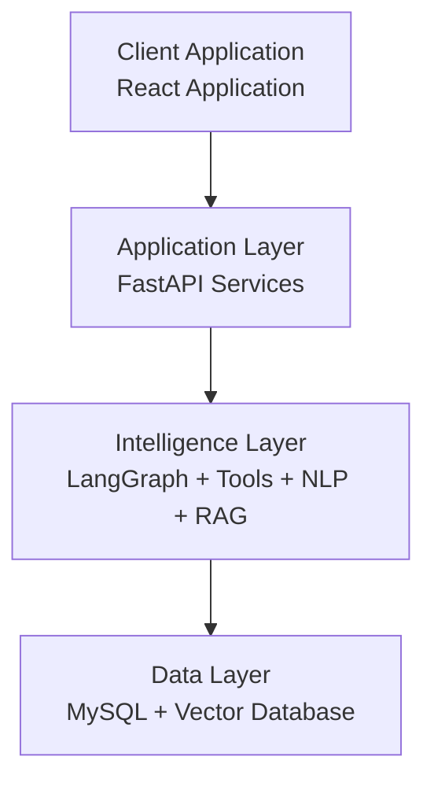

The purpose of this separation is to keep business logic, AI processing, and data storage independent.

---

# 10. High Level Design (HLD)

## 10.1 System Architecture

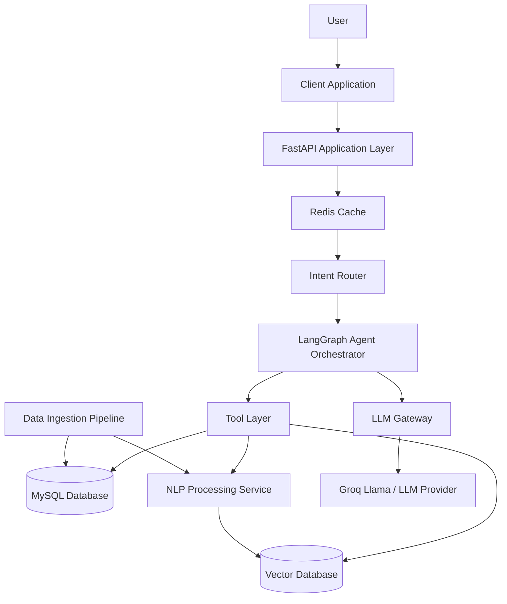

## 10.2 Component Overview

### Client Application

The client application provides the interface through which users interact with Arcademia AI.

Responsibilities:

- Accept user queries.
- Display game information.
- Display AI-generated insights.
- Show recommendations and comparisons.

Technology:

- React
- Tailwind CSS

The client application does not directly communicate with databases or AI services.

---

### FastAPI Application Layer

The FastAPI layer acts as the main entry point for application requests.

Responsibilities:

- Receive API requests.
- Validate input.
- Manage request flow.
- Communicate with application services.
- Return formatted responses.

The application layer does not directly contain AI model logic.

---

### Redis Cache

Redis is used as an optional caching layer.

Responsibilities:

- Store frequently requested responses.
- Reduce repeated AI calls.
- Improve response time.

Examples:

- Popular game comparisons.
- Common search queries.
- Frequently requested recommendations.

---

### Intent Router

The intent router determines the type of request before starting an AI workflow.

Examples:

User query:

```
Suggest games similar to Skyrim.
```

Routing result:

```
Recommendation Workflow
```

User query:

```
Why do players dislike this game?
```

Routing result:

```
Review Analysis Workflow
```

The goal is to avoid unnecessary LLM calls for simple request classification.

---

### LangGraph Agent Orchestrator

The agent orchestrator manages AI workflows.

Responsibilities:

- Maintain workflow state.
- Select required tools.
- Coordinate multiple processing steps.
- Generate final responses through the LLM gateway.

Agents do not directly access databases. They interact with the system through defined tools.

---

### Tool Layer

The tool layer provides controlled access to application capabilities.

Examples:

- Game Search Tool.
- Semantic Search Tool.
- Review Analysis Tool.
- Recommendation Tool.
- Comparison Tool.

The tool layer separates AI decision-making from data access logic.

---

### MySQL Database

MySQL stores structured application data.

Examples:

- Games.
- Developers.
- Genres.
- Ratings.
- Statistics.
- Processed metadata.

MySQL is used because game information contains relational data and relationships between different entities.

---

### Vector Database

The vector database stores generated embeddings.

Responsibilities:

- Semantic search.
- Similarity matching.
- Retrieval for RAG workflows.

It stores information such as:

- Review embeddings.
- Game description embeddings.
- Processed text representations.

---

### NLP Processing Service

The NLP service processes unstructured review text.

Responsibilities:

- Text cleaning.
- Sentiment analysis.
- Topic extraction.
- Entity extraction.
- Embedding generation.

Transformer-based models are used to understand the meaning of text.

---

### LLM Gateway

The LLM gateway provides an abstraction layer between the application and external LLM providers.

Responsibilities:

- Manage LLM provider communication.
- Handle retries and timeouts.
- Track token usage.
- Support fallback providers.
- Control prompt construction.

The gateway allows the LLM provider to be replaced without changing application logic.

---

### Data Ingestion Pipeline

The ingestion pipeline prepares raw Steam dataset files for application usage.

Responsibilities:

- Read dataset files.
- Validate input data.
- Clean inconsistent values.
- Store structured information in MySQL.
- Trigger NLP processing for review data.

The dataset files are treated as input sources and are not used directly during runtime.

# 11. System Data Flow

Arcademia AI processes data through separate ingestion, intelligence, and application workflows.

The system has two major flows:

1. Offline data processing flow
2. Runtime user request flow

The offline flow prepares data before users interact with the application.

The runtime flow handles user queries, retrieves required information, and generates responses.

---

## 11.1 Data Processing Flow

The data processing pipeline converts raw Steam dataset files into application-ready data.

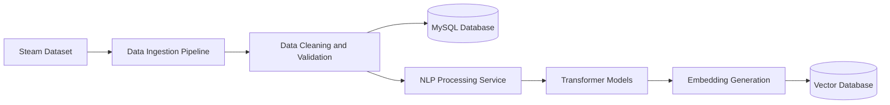

The pipeline performs the following operations:

- Reads raw dataset files.
- Validates and cleans data.
- Stores structured game information in MySQL.
- Processes review text using NLP models.
- Generates embeddings for semantic search.
- Stores embeddings in the vector database.

---

## 11.2 User Request Flow

The runtime request flow is designed to minimize unnecessary AI calls.

The system first identifies the user intent, retrieves required information using tools, and uses the LLM only for reasoning and response generation.

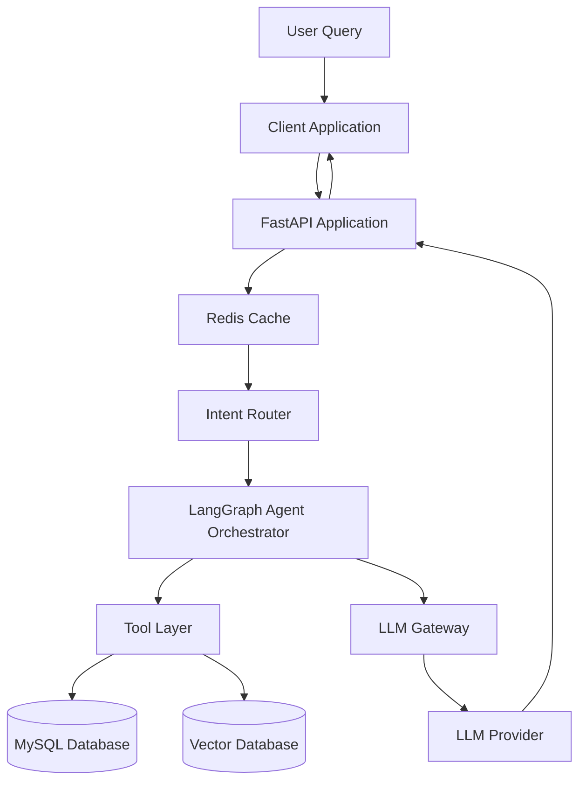

The request flow follows these steps:

1. User sends a query through the client application.
2. FastAPI receives and validates the request.
3. Cache is checked for frequently requested responses.
4. Intent router identifies the required workflow.
5. LangGraph orchestrator selects required tools.
6. Tools retrieve information from MySQL, vector database, or NLP services.
7. Relevant context is sent through the LLM Gateway.
8. LLM generates the final response.

---

# 12. Data Architecture

Arcademia AI works with two major types of data:

- Structured data
- Unstructured text data

Each data type has different storage and processing requirements.

Structured game information is stored in MySQL because it contains relationships between entities such as games, developers, genres, ratings, and statistics.

Unstructured review text is processed using NLP models. The generated embeddings are stored in a vector database for semantic search and RAG workflows.

The overall data architecture is:

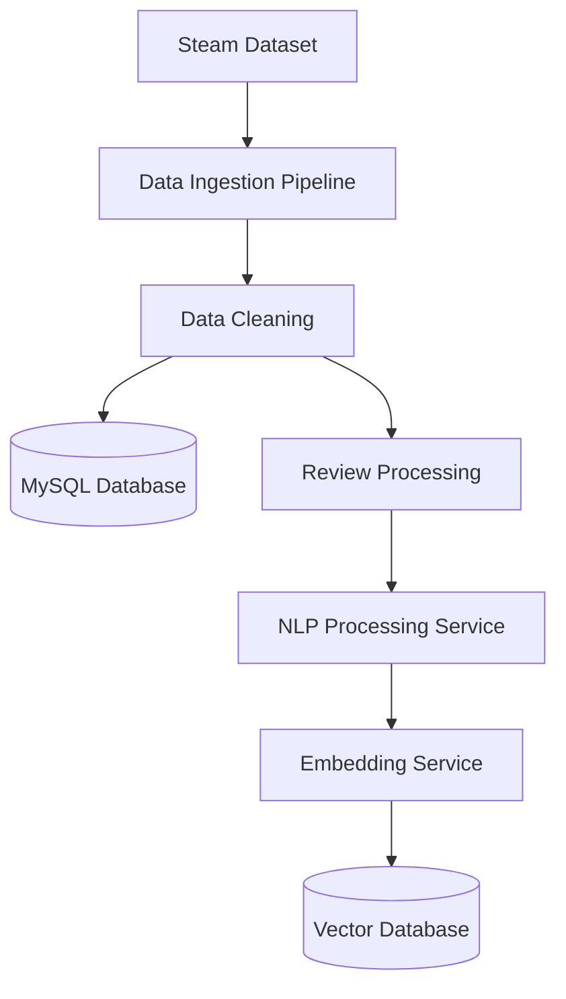

---

## 12.1 Structured Data Storage

Structured data is stored in MySQL.

Examples:

- Game information
- Developers
- Genres
- Ratings
- Price information
- Player statistics
- Processed analysis results

MySQL provides:

- Relational data management
- Indexing support
- Consistent data storage
- Efficient structured queries

---

## 12.2 Unstructured Data Storage

Review text contains opinions and experiences that cannot be represented effectively using normal database queries.

The NLP pipeline converts review text into meaningful representations.

Processed information includes:

- Sentiment information
- Extracted topics
- Text embeddings

Embeddings are stored in the vector database for similarity search.

---

# 13. Data Ingestion Pipeline

The data ingestion pipeline is responsible for converting raw Steam dataset files into application-ready data.

The ingestion pipeline runs separately from the application runtime so that data processing does not affect user requests.

The pipeline performs:

- Dataset loading.
- Data validation.
- Data cleaning.
- Data transformation.
- MySQL storage.
- Review processing trigger.

---

## 13.1 Data Processing Flow

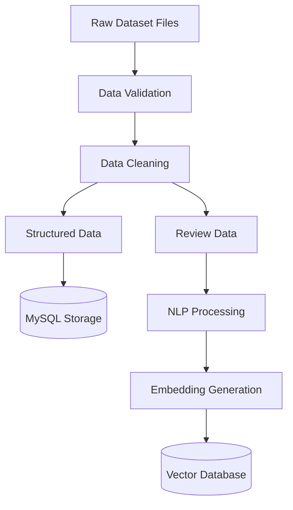

---

## 13.2 Handling Data Quality Issues

Real-world datasets may contain incomplete or inconsistent records.

Possible issues:

- Missing game information
- Empty reviews
- Duplicate records
- Invalid dates
- Incorrect formatting

The ingestion pipeline handles these cases by:

- Validating required fields before processing.
- Removing duplicate records.
- Storing missing optional values as NULL.
- Logging failed records.
- Continuing processing for valid records.

A single invalid record should not stop the complete ingestion process.

---

## 13.3 Data Processing Status Tracking

Long-running processing tasks should maintain execution status.

Example:

```
PENDING
PROCESSING
COMPLETED
FAILED
```

This allows failed operations to be retried without restarting the complete pipeline.

---

# 14. MySQL Database Design

MySQL stores structured information required by Arcademia AI.

The database follows a relational design because games have relationships with developers, genres, and reviews.

The database is responsible only for structured information. Semantic search and similarity matching are handled by the vector database.

---

## 14.1 Entity Relationship Overview

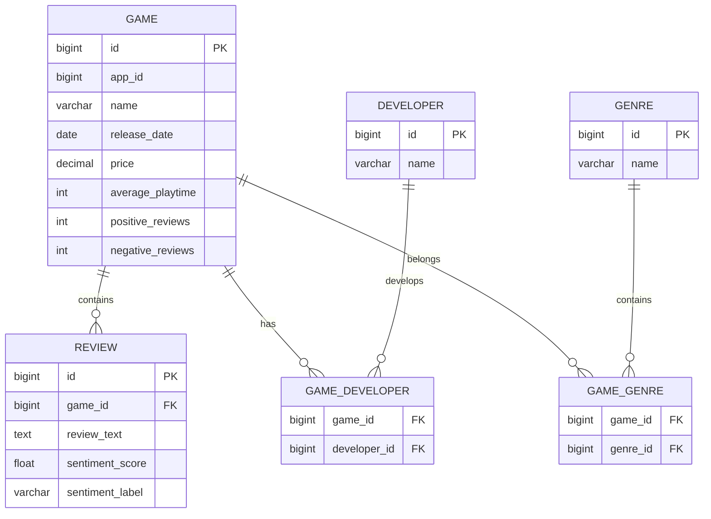

---

## 14.2 Game Table

Stores basic information about games.

**Game**

- id
- app_id
- name
- release_date
- price
- average_playtime
- positive_reviews
- negative_reviews
- recommendations
- created_at
- updated_at

Responsibilities:

- Store game metadata.
- Support structured search.
- Provide information for recommendations and comparisons.

---

## 14.3 Developer Table

Stores developer information.

**Developer**

- id
- name

Keeping developers separate avoids duplicate storage when multiple games belong to the same developer.

---

## 14.4 Genre Table

Stores game genre information.

**Genre**

- id
- name

A separate genre table supports many-to-many relationships.

Example:

Game:

```
The Witcher 3
```

Genres:

- RPG
- Adventure
- Open World

---

## 14.5 Review Table

Stores processed review information.

**Review**

- id
- game_id
- review_text
- sentiment_score
- sentiment_label
- created_at

The review table stores processed analysis results so the NLP pipeline does not need to execute repeatedly for the same review.

---

## 14.6 Database Indexing Strategy

Indexes are created for frequently accessed fields.

Examples:

Game search:

```sql
INDEX(name)
```

Finding reviews for a game:

```sql
INDEX(game_id)
```

Sorting by popularity:

```sql
INDEX(recommendations)
```

Indexes improve query performance as the dataset size increases.

---

# 15. NLP Pipeline Design

The NLP pipeline converts unstructured review text into useful information.

The system does not train transformer models from scratch.

Instead, it uses pretrained transformer models and focuses on applying them efficiently.

The NLP pipeline contains:

- Text preprocessing.
- Sentiment analysis.
- Topic extraction.
- Entity extraction.
- Embedding generation.

---

## 15.1 Text Processing

Before sending reviews to NLP models, the text is cleaned and normalized.

Processing steps include:

- Removing unnecessary symbols.
- Removing duplicate spaces.
- Handling empty reviews.
- Normalizing text format.

Example:

Before:

```
THIS GAME IS AMAZING!!!! 100% recommended!!!
```

After:

```
this game is amazing recommended
```

---

## 15.2 Sentiment Analysis

Sentiment analysis identifies player opinions from reviews.

Example:

Review:

```
The gameplay is amazing but the game crashes frequently.
```

Possible analysis:

- Positive: Gameplay
- Negative: Performance issues
- Overall: Mixed sentiment

A transformer-based classification model is used for sentiment detection.

The processed sentiment result is stored so repeated analysis is avoided.

---

## 15.3 Topic Extraction

Topic extraction identifies frequently discussed areas in player reviews.

Example reviews:

- The story is excellent.
- Combat feels satisfying.
- The game performance is poor.

Extracted topics:

- Story
- Combat
- Performance

These topics help summarize player discussions.

---

## 15.4 Named Entity Extraction

Named Entity Recognition identifies important entities from review text.

Example:

Review:

```
Cyberpunk 2077 has amazing visuals but poor optimization.
```

Extracted information:

- Game: Cyberpunk 2077
- Topic: Optimization

This information can improve search, filtering, and analysis workflows.

# 16. Transformer Model Usage

Arcademia AI uses transformer-based models to understand and process unstructured text data such as player reviews.

Traditional keyword-based approaches cannot understand the context and meaning behind sentences. Transformer models help the system understand relationships between words and generate meaningful representations of text.

The system uses pretrained transformer models for:

- Text classification.
- Sentiment analysis.
- Text embeddings.
- Semantic similarity search.

The initial version does not train transformer models from scratch. It uses existing pretrained models and focuses on efficient application of these models within the AI pipeline.

---

## 16.1 Why Transformers?

Traditional keyword-based methods treat different phrases as unrelated even when they express similar meanings.

Example:

```
"great story"

"excellent narrative"
```

A keyword-based system may consider these as different phrases.

Transformer models understand that both sentences represent a similar idea.

This improves:

- Search relevance.
- Recommendation quality.
- Review understanding.
- Semantic similarity matching.

---

## 16.2 Embedding Generation

Embeddings convert text information into numerical vectors that represent the meaning of the text.

Example:

Input text:

```text
The game has an amazing story.
```

Generated embedding:

```text
[0.24, 0.71, 0.15, ....]
```

These numbers represent the semantic meaning of the sentence.

Texts with similar meanings produce similar vector representations.

The generated embeddings are stored in the vector database and used during semantic search and RAG retrieval.

---

## 16.3 Embedding Pipeline

The embedding generation process happens during data processing instead of during user requests.

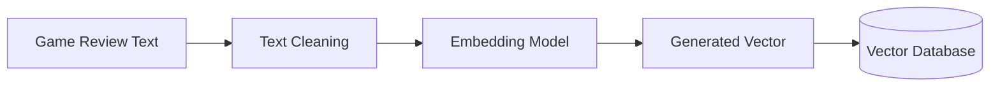

This approach reduces runtime processing and improves response speed.

---

# 17. Vector Database Design

The vector database stores semantic representations generated from text data.

It is responsible for similarity-based retrieval and supports RAG workflows.

The vector database stores embeddings created from:

- Game descriptions.
- Player reviews.
- Extracted topics.
- Processed text summaries.

The vector database works together with MySQL:

- MySQL stores structured information.
- Vector database stores semantic information.

---

## 17.1 Semantic Search

Semantic search allows users to search using meaning instead of exact keywords.

Example user query:

```
Games with emotional stories and memorable characters
```

A traditional keyword search may fail if those exact words are not present.

Semantic search can identify relevant content:

Game A:

```
"The story creates a strong emotional connection with players."
```

Game B:

```
"Characters are deeply written and memorable."
```

The system finds these results because their meaning is similar.

---

## 17.2 Vector Document Structure

Each vector document contains the original text, metadata, and generated embedding.

Example:

**Vector Document**

- id: `review_12345`
- content: `"The story and characters are excellent."`
- metadata:

```json
{
  "game_id": 500,
  "game_name": "Game Name",
  "genre": "RPG"
}
```

- embedding: `[0.23, 0.54, 0.89, ...]`

Metadata helps filter search results and connect vector results with structured information stored in MySQL.

---

## 17.3 Semantic Retrieval Flow

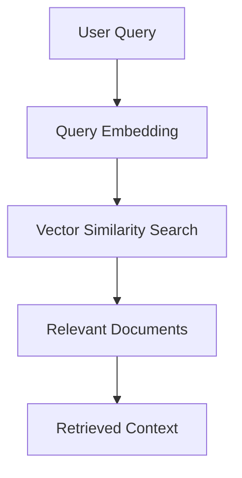

The retrieved context is passed to the RAG workflow for response generation.

---

# 18. Retrieval-Augmented Generation (RAG) Design

RAG allows Arcademia AI to generate responses based on its own dataset.

Instead of depending only on the LLM's existing knowledge, the system first retrieves relevant information from the vector database and structured data sources.

The RAG workflow is:

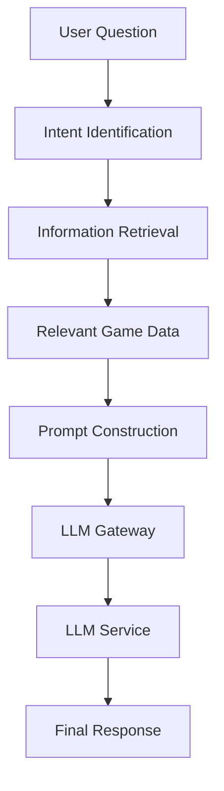

---

## 18.1 Why RAG is Used

Without RAG:

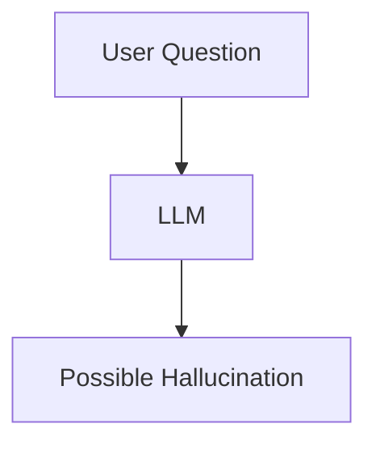

The LLM may generate information that is not based on the application's data.

With RAG:

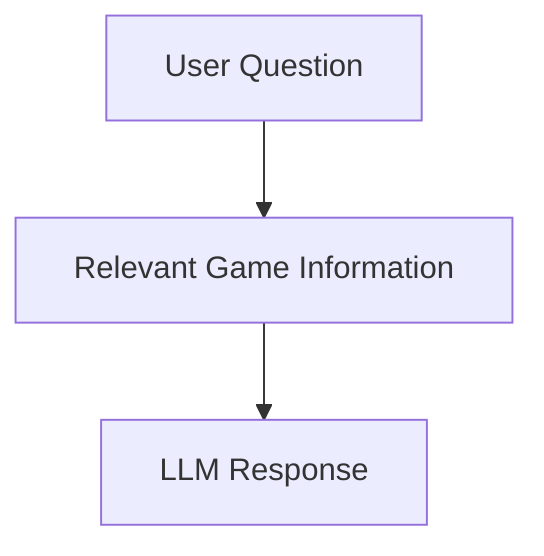

The response is generated using retrieved information from Arcademia AI's own data sources.

---

## 18.2 RAG Optimization

The system avoids sending unnecessary information to the LLM.

The retrieval process follows:

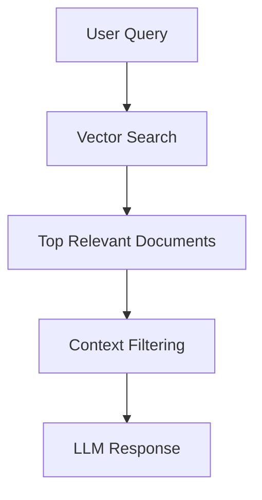

This reduces:

- Token consumption.
- Response latency.
- Unnecessary model calls.

---

# 19. Agent Architecture

Arcademia AI uses agent-based workflows to handle different types of user requests.

Instead of using one large AI function, the system separates responsibilities into different workflows.

The agent workflows are managed using LangGraph.

Each workflow has:

- A defined purpose.
- Required tools.
- Controlled data access.
- Clear execution steps.

---

## 19.1 Agent Workflow Architecture

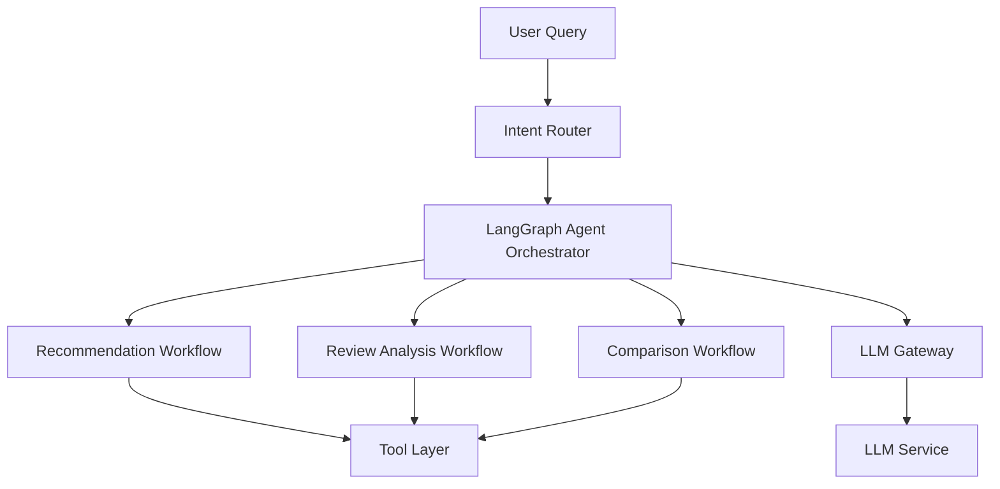

The agent orchestrator decides which workflow should handle the request.

Agents do not directly access databases or external services.

They interact through the tool layer.

---

## 19.2 Intent Router

The intent router identifies the type of user request before starting an AI workflow.

Examples:

User query:

```
Suggest games similar to Skyrim.
```

Routing result:

```
Recommendation Workflow
```

User query:

```
Why do players dislike this game?
```

Routing result:

```
Review Analysis Workflow
```

The router reduces unnecessary LLM usage by avoiding model calls for simple request classification.

---

## 19.3 Recommendation Workflow

The recommendation workflow finds relevant games based on:

- Game metadata.
- Genre similarity.
- Semantic similarity.
- Player feedback.
- Review patterns.

The workflow uses tools to retrieve candidate games and uses the LLM only to explain the recommendation.

Example:

```
Recommended:

The Witcher 3

Reason:

Similar open-world RPG structure,
strong storytelling, and positive player feedback.
```

---

## 19.4 Review Analysis Workflow

The review analysis workflow processes player feedback.

Responsibilities:

- Retrieve relevant reviews.
- Analyze sentiment information.
- Identify common topics.
- Summarize player opinions.

Example:

Players like:

- Story
- Exploration

Players dislike:

- Performance issues
- Bugs

---

## 19.5 Comparison Workflow

The comparison workflow compares games using available information.

It considers:

- Game metadata.
- Ratings.
- Review sentiment.
- Player feedback.
- Semantic review insights.

Example:

```
Compare Elden Ring and Dark Souls.
```

The workflow retrieves relevant information and generates a structured comparison.

---

## 19.6 Tool Calling Design

Agents do not directly communicate with databases.

All external operations are performed through tools.

Example:

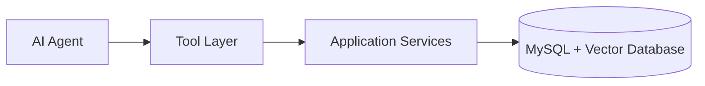

Available tools include:

- Game Search Tool.
- Semantic Search Tool.
- Review Analysis Tool.
- Recommendation Tool.
- Comparison Tool.

This keeps AI workflows independent from storage implementation details.

---

# 20. Backend Low Level Design (LLD)

The backend follows a layered architecture where each component has a clear responsibility.

The repository structure is organized based on system responsibilities rather than technical frameworks.

The structure is:

```
arcademia-ai
├── application
│   ├── api
│   ├── services
│   ├── domain
│   └── configuration
│
├── intelligence
│   ├── agents
│   ├── tools
│   ├── rag
│   ├── embeddings
│   ├── models
│   └── prompts
│
├── data-platform
│   ├── ingestion
│   ├── processing
│   ├── migrations
│   └── schemas
│
├── infrastructure
│   ├── docker
│   └── deployment
│
├── tests
│
└── docs
```

---

## 20.1 Application Layer

The application layer handles normal application logic.

Responsibilities:

- API request handling.
- Business workflows.
- Validation.
- Communication between components.

It does not contain AI model implementation.

---

## 20.2 API Layer

The API layer handles HTTP communication.

Example:

```
POST /api/ai/query
```

Responsibilities:

- Receive requests.
- Validate input.
- Return responses.
- Handle API-level errors.

---

## 20.3 Service Layer

The service layer contains application logic.

Responsibilities:

- Coordinate workflows.
- Process business operations.
- Communicate with data access components.

Examples:

- Game search service.
- Recommendation service.
- Comparison service.

---

## 20.4 Intelligence Layer

The intelligence layer contains AI-specific components.

Structure:

```
intelligence
├── agents
├── tools
├── embeddings
├── models
├── rag
└── prompts
```

Responsibilities:

- Manage AI workflows.
- Execute tool calls.
- Handle retrieval.
- Generate embeddings.
- Manage prompts.

This separation allows AI components to change without affecting the application layer.

# 21. Design Principles Used

Arcademia AI follows software design principles that keep the system modular, maintainable, and easier to extend.

These principles help different parts of the system evolve independently without creating unnecessary dependencies.

---

## Separation of Responsibility

Each component has a clearly defined responsibility.

Examples:

- MySQL stores structured game information.
- Vector database handles semantic retrieval.
- NLP services process and analyze text data.
- Agents manage AI workflow decisions.
- Tools provide controlled access to application capabilities.
- LLM Gateway manages communication with external AI providers.

This separation keeps the system organized and reduces complexity.

---

## Loose Coupling

Components communicate through well-defined interfaces instead of depending on internal implementation details.

Example:

The recommendation workflow does not need to know how embeddings are generated or where they are stored.

It only requests similar game information through the semantic search tool.

This allows individual components to be replaced without affecting the complete system.

Examples:

- Changing the embedding model.
- Replacing the vector database.
- Changing the LLM provider.

---

## Extensibility

The architecture supports future additions without major changes to existing modules.

Possible extensions include:

- New AI workflows.
- New data sources.
- Improved NLP models.
- Additional search capabilities.
- Real-time data ingestion.
- New analysis tools.

---

## Controlled AI Usage

LLMs are used only where reasoning and natural language generation are required.

The system avoids unnecessary AI calls by using:

- Intent routing.
- Application logic.
- Retrieval tools.
- Cached responses.

This reduces cost, improves response time, and makes the system easier to test.

---

## Fault Isolation

Failures in one component should not affect the complete application.

Examples:

- LLM provider failure should not break game search.
- Vector database failure should allow fallback search.
- NLP processing failure should not stop complete data ingestion.

Each component should fail independently with proper error handling.

---

# 22. API Design

Arcademia AI exposes REST APIs through FastAPI.

The API layer acts as the entry point between the client application and backend services.

Responsibilities:

- Receive client requests.
- Validate request data.
- Communicate with application services.
- Return structured responses.

The API layer does not directly contain:

- Database queries.
- NLP processing logic.
- Agent workflow logic.

These responsibilities belong to their respective layers.

---

## 22.1 Game Search API

**Endpoint**

```http
GET /api/games/search
```

**Purpose**

Search games using structured filters and keyword-based queries.

**Request Example**

```http
GET /api/games/search?query=survival+rpg
```

**Processing Flow**

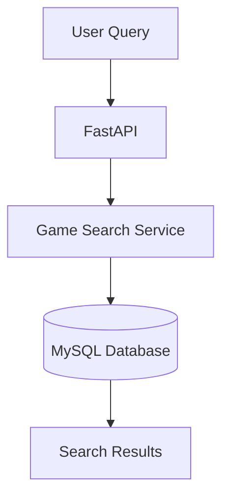

**Response Example**

```json
{
  "games": [
    {
      "name": "Example Game",
      "genre": "RPG",
      "rating": 4.5
    }
  ]
}
```

---

## 22.2 AI Query API

**Endpoint**

```http
POST /api/ai/query
```

**Purpose**

Accept natural language questions and generate AI-powered responses.

**Request**

```json
{
  "question": "Why do players like Elden Ring?"
}
```

**Processing Flow**

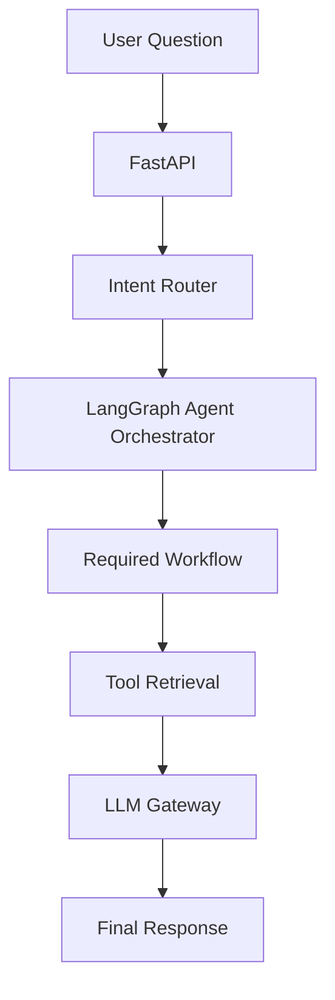

**Response**

```json
{
  "answer": "Players appreciate Elden Ring because of...",
  "sources": [
    "review_12345",
    "game_metadata"
  ]
}
```

---

## 22.3 Game Comparison API

**Endpoint**

```http
POST /api/games/compare
```

**Purpose**

Compare two games using structured data and player feedback.

**Request**

```json
{
  "game1": "Witcher 3",
  "game2": "Skyrim"
}
```

**Response**

```json
{
  "comparison": {
    "story": "...",
    "gameplay": "...",
    "player_feedback": "..."
  }
}
```

---

## 22.4 Recommendation API

**Endpoint**

```http
POST /api/games/recommend
```

**Purpose**

Generate game recommendations based on user preferences.

**Request**

```json
{
  "preferences": "Open world games with strong storytelling"
}
```

**Processing Flow**

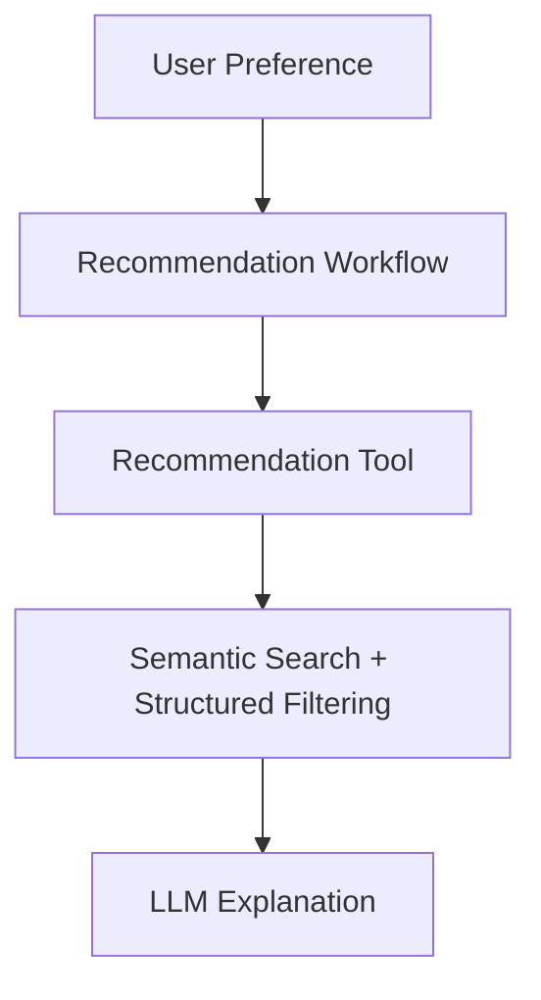

**Response**

```json
{
  "recommendations": [
    {
      "game": "Game Name",
      "reason": "Similar story and gameplay style"
    }
  ]
}
```

---

# 23. Error Handling

Arcademia AI is designed to handle failures gracefully and provide meaningful responses.

Errors are categorized based on their source.

---

## 23.1 Client Errors

These errors occur due to invalid user input.

Examples:

- Empty queries.
- Missing required fields.
- Invalid game names.
- Incorrect request format.

Response example:

```json
{
  "error": "Invalid request",
  "message": "Question cannot be empty"
}
```

---

## 23.2 Database Errors

Possible database failures:

- MySQL unavailable.
- Query failure.
- Connection timeout.

Handling strategy:

- Retry failed connections.
- Log database errors.
- Return fallback responses when possible.
- Avoid exposing internal database details.

---

## 23.3 AI Service Errors

Possible AI failures:

- LLM timeout.
- API rate limit reached.
- Invalid model response.
- External provider unavailable.

Handling strategy:

- Use timeout limits.
- Retry temporary failures.
- Use fallback providers when available.
- Return cached responses where possible.

Example:

```
Unable to generate AI analysis currently.
Please try again later.
```

---

## 23.4 Vector Search Errors

Possible failures:

- Vector database unavailable.
- Missing embeddings.
- Search timeout.

Handling strategy:

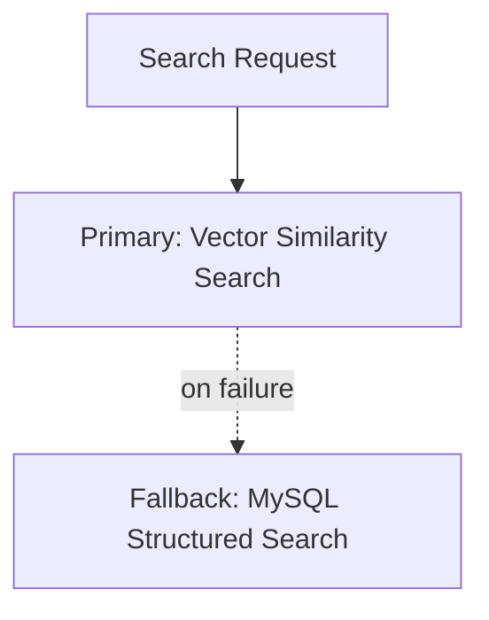

The system may provide less detailed results but should continue operating.

---

# 24. Failure Scenarios and Solutions

This section describes possible failures and how Arcademia AI handles them.

---

## 24.1 Dataset Processing Failure

**Problem**

During ingestion, some records may contain invalid or incomplete information.

Examples:

- Missing game name
- Invalid release date
- Corrupted review data

**Solution**

The ingestion pipeline should:

- Validate records before processing.
- Skip invalid records.
- Store failed records for debugging.
- Continue processing valid records.

A single invalid record should not stop the complete pipeline.

---

## 24.2 Duplicate Data During Ingestion

**Problem**

The same game may be inserted multiple times during data loading.

**Solution**

Use:

- Unique constraints on `app_id`.
- Upsert operations.
- Data validation before insertion.

Example:

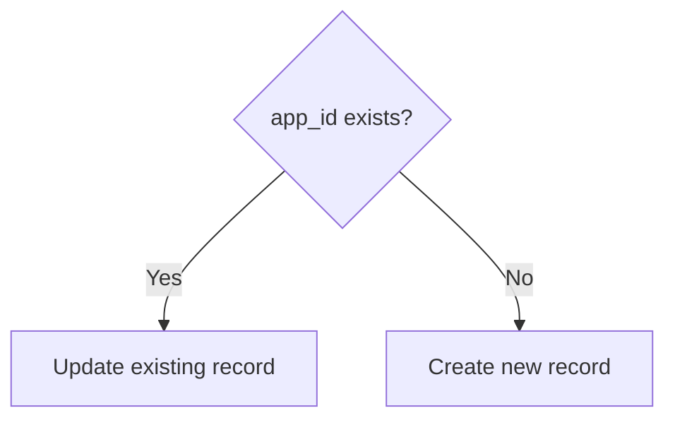

---

## 24.3 NLP Processing Failure

**Problem**

A review cannot be processed by the NLP pipeline.

Possible reasons:

- Empty text.
- Invalid format.
- Model execution failure.

**Solution**

The pipeline should:

- Validate input before processing.
- Track processing status.
- Retry failed records.
- Continue processing remaining reviews.

Example status:

```
PENDING
PROCESSING
COMPLETED
FAILED
```

---

## 24.4 Incorrect AI Response

**Problem**

LLMs may generate incorrect or unsupported information.

**Solution**

Arcademia AI uses RAG-based responses.

The LLM receives:

- Retrieved game information.
- Relevant reviews.
- Processed insights.

The system should also:

- Restrict responses to available context.
- Include retrieved sources.
- Reduce unsupported generation.

---

## 24.5 LLM Provider Failure

**Problem**

The external LLM provider may be unavailable or rate limited.

**Solution**

The LLM Gateway handles:

- Request retries.
- Timeout handling.
- Provider switching.
- Token tracking.

Possible fallback:

```mermaid
flowchart TD

Primary[Primary: Groq Llama API]
Alt[Fallback: Alternative Model Provider]
Cache[Fallback: Cached Response]

Primary -.on failure.-> Alt
Primary -.on failure.-> Cache
```

---

## 24.6 Slow AI Response

**Problem**

AI responses may become slow due to:

- Vector search.
- Retrieval processing.
- LLM generation.

**Solution**

Use:

- Response caching.
- Optimized retrieval size.
- Smaller context windows.
- Background processing for heavy operations.

---

## 24.7 Vector Database Failure

**Problem**

Semantic search becomes unavailable.

**Solution**

The system can temporarily use:

- MySQL filtering.
- Keyword search.
- Previously cached results.

The system remains available with reduced search accuracy.

---

# 25. Security Considerations

Although Arcademia AI focuses on game analysis, security practices are included.

---

## 25.1 Input Validation

All user inputs should be validated before processing.

Examples:

- Maximum query length.
- Empty request validation.
- Invalid character handling.
- Request format validation.

This prevents unexpected application behavior.

---

## 25.2 API Protection

Future production versions should include:

- Authentication.
- Authorization.
- API rate limiting.

Example:

A single user should not generate unlimited AI requests because external AI services have usage limits.

---

## 25.3 Protecting Sensitive Configuration

Sensitive information should never be stored directly in source code.

Examples:

- API keys.
- Database passwords.
- Secret tokens.

These values should be managed using:

- Environment variables.
- Secret management systems.
- Secure deployment configuration.

---

## 25.4 Prompt Safety

Since user input can influence AI workflows, prompt handling should be controlled.

The system should:

- Validate user queries.
- Prevent unnecessary system instruction exposure.
- Restrict unsafe model behavior.
- Keep prompts managed internally.

---

# 26. Performance Optimization

Arcademia AI uses multiple strategies to improve response time and reduce resource usage.

---

## 26.1 Database Optimization

MySQL optimization includes:

- Proper indexing.
- Efficient queries.
- Pagination.
- Query optimization.

Example:

Instead of loading all games:

```sql
SELECT * FROM games;
```

Use:

```sql
SELECT *
FROM games
LIMIT 20 OFFSET 0;
```

This prevents unnecessary data retrieval.

---

## 26.2 Embedding Optimization

Generating embeddings during every user request increases latency and cost.

Therefore, embeddings are generated during offline data processing.

Runtime flow:

```mermaid
flowchart TD

Query[User Query]
Embed[Generate Query Embedding]
Search[Search Existing Embeddings]
Results[Retrieve Relevant Results]

Query --> Embed
Embed --> Search
Search --> Results
```

---

## 26.3 Caching

Frequently requested information can be cached.

Examples:

- Popular game searches.
- Common comparisons.
- Frequently asked questions.

Caching flow:

```mermaid
flowchart LR

API[FastAPI]
Cache[Redis Cache]
Services[Application Services]
Data[Database / AI Workflow]

API --> Cache
Cache --> Services
Services --> Data
```

Benefits:

- Reduced response time.
- Lower LLM usage.
- Reduced database load.

---

## 26.4 Background Processing

Heavy operations should not block user requests.

Examples:

- Dataset ingestion.
- Embedding generation.
- Large NLP processing jobs.

Future architecture:

```mermaid
flowchart LR

API[API]
Queue[Message Queue]
Worker[Worker Service]
Processing[NLP / Data Processing]

API --> Queue
Queue --> Worker
Worker --> Processing
```

This allows long-running tasks to execute independently.

---

# 27. Scalability Strategy

The current architecture is designed for a small development environment but supports future expansion.

---

## 27.1 Adding More Data Sources

Current source:

- Steam Dataset

Future sources:

- Steam API
- Gaming News Sources
- Community Forums

The ingestion layer can be extended without changing AI workflows.

---

## 27.2 Adding More AI Workflows

New workflows can be added independently.

Current workflows:

- Recommendation Workflow
- Review Analysis Workflow
- Comparison Workflow

Future workflows:

- Trend Analysis Workflow
- Price Analysis Workflow
- Community Analysis Workflow

The agent orchestration layer allows new workflows to be added without changing existing components.

## 27.3 Model Replacement

Arcademia AI is designed to remain independent from any specific AI model implementation.

AI components are isolated behind dedicated services so that models can be replaced without affecting the rest of the system.

Example:

Current embedding model:

```
Embedding Model A
```

Future embedding model:

```
Embedding Model B
```

Only the embedding service requires modification.

Other components remain unchanged:

- Application layer.
- Agent workflows.
- Tool layer.
- RAG pipeline.
- Database layer.

The same approach applies to:

- Embedding models.
- NLP classification models.
- LLM providers.

The LLM Gateway provides abstraction between AI workflows and external model providers, allowing providers such as Groq Llama or other compatible models to be changed without modifying application logic.

---

# 28. Deployment Architecture

Arcademia AI is designed as a collection of independent services.

Each service has a clear responsibility and can be deployed separately.

The deployment architecture is:

```mermaid
flowchart TD

User[User]

Client[Client Application]

API[FastAPI Application]

Cache[Redis Cache]

MySQL[(MySQL Database)]

Vector[(Vector Database)]

NLP[NLP Services]

LLMGateway[LLM Gateway]

LLM[External LLM Provider]


User --> Client

Client --> API

API --> Cache

API --> MySQL

API --> Vector

API --> NLP

API --> LLMGateway

LLMGateway --> LLM
```

---

## 28.1 Containerization

Docker is used to package application components into isolated containers.

A possible deployment setup:

`docker-compose.yml`

```yaml
services:
  client-application
  api-service
  mysql
  vector-database
  redis
  nlp-service
```

Benefits:

- Same development and deployment environment.
- Easier dependency management.
- Faster project setup.
- Independent service execution.

---

## 28.2 Environment Configuration

Application configuration should be managed separately from source code.

Examples:

- Database connection details.
- API keys.
- LLM provider configuration.
- Service URLs.

Configuration should be provided through:

- Environment variables.
- Deployment configuration files.
- Secret management systems.

---

## 28.3 Deployment Scaling

Different components can scale independently based on workload.

Examples:

| Scenario | Scaling response |
|---|---|
| High API traffic | Increase API service instances |
| Large NLP processing workload | Increase NLP worker instances |
| Heavy vector search usage | Scale vector database resources |

The architecture avoids making the complete application dependent on a single service instance.

---

# 29. Logging and Monitoring

Arcademia AI maintains logs to understand system behavior and identify failures.

Important events include:

- API requests.
- Request processing time.
- Failed ingestion jobs.
- NLP processing failures.
- Database errors.
- Vector search failures.
- LLM provider failures.
- Token usage information.

Example:

```
INFO: Processed game embeddings successfully

ERROR: Vector database connection failed
```

---

## 29.1 Logging Strategy

Logs should contain useful debugging information without exposing sensitive data.

Important log information:

- Request identifier.
- Component name.
- Execution status.
- Error details.
- Processing duration.

Example:

```
Request ID: abc123
Component: Recommendation Workflow
Status: FAILED
Reason: LLM timeout
```

---

## 29.2 Monitoring Metrics

Future monitoring can track:

**Application Metrics**

- API response latency.
- Request count.
- Error rate.
- Active users.

**AI Metrics**

- LLM response time.
- Token consumption.
- Failed generations.
- Retrieval quality.

**Infrastructure Metrics**

- CPU usage.
- Memory usage.
- Database health.
- Service availability.

---

# 30. Testing Strategy

Testing is divided into multiple levels to validate application logic, data processing, and AI workflows.

---

## 30.1 Unit Testing

Unit tests validate individual components independently.

Examples:

- Data cleaning functions.
- Sentiment processing functions.
- Recommendation logic.
- API validation.
- Utility functions.

The goal is to verify that individual modules work correctly.

---

## 30.2 Integration Testing

Integration tests verify communication between different system components.

Examples:

- API to application service.
- Application service to MySQL.
- Tool layer to vector database.
- Agent workflow execution.
- LLM Gateway communication.

---

## 30.3 Data Pipeline Testing

The ingestion and NLP pipelines require separate validation.

Testing includes:

- CSV loading.
- Data validation.
- Data transformation.
- Database insertion.
- Embedding generation.
- Failed record handling.

Example:

A corrupted review should fail gracefully without stopping the complete pipeline.

---

## 30.4 AI Workflow Testing

AI systems cannot be tested only through exact output matching.

Evaluation focuses on:

- Response relevance.
- Retrieval accuracy.
- Context quality.
- Hallucination reduction.
- Tool selection correctness.

Example:

For a recommendation query:

Expected:

- Relevant games retrieved
- Correct explanation

Not only:

- Exact sentence match

---

## 30.5 Performance Testing

Performance testing validates system behavior under load.

Examples:

- Multiple simultaneous API requests.
- Large search queries.
- High-volume recommendation requests.
- Large NLP processing jobs.

The objective is to identify bottlenecks before deployment.

---

# 31. Future Improvements

The current architecture provides a foundation for additional capabilities.

---

## Real-Time Data Updates

Currently, Arcademia AI processes a static Steam dataset.

Future improvements can include:

- Scheduled Steam API ingestion.
- Automatic dataset refresh.
- Incremental data updates.

The ingestion layer can be extended without changing AI workflows.

---

## Better Recommendations

Future recommendation improvements can include:

- User preference tracking.
- Collaborative filtering.
- Personalized recommendations.
- Play history analysis.

---

## Knowledge Graph Integration

A knowledge graph can be added to represent relationships between entities.

Possible relationships:

- Games.
- Developers.
- Genres.
- Characters.
- Players.
- Reviews.

This can improve complex queries and relationship-based analysis.

---

## Better AI Evaluation

Future improvements can include automated evaluation systems for:

- Search quality.
- Recommendation accuracy.
- RAG retrieval quality.
- AI response correctness.

---

## Cloud Deployment

The platform can be deployed using cloud services.

Possible technologies:

- Azure.
- Docker.
- Managed databases.
- Cloud-based AI services.

Cloud deployment can improve reliability, scalability, and availability.

---

# 32. Conclusion

Arcademia AI combines structured data processing, NLP, transformer models, semantic search, RAG workflows, and agent-based AI orchestration to create an intelligent game analysis platform.

The architecture separates responsibilities between different system components:

- MySQL manages structured game information.
- NLP services process and analyze player reviews.
- Vector databases provide semantic retrieval.
- Tools provide controlled access to application capabilities.
- Agents coordinate AI workflows.
- LLM Gateway manages communication with AI providers.

The design focuses on maintainability, scalability, fault tolerance, and future extensibility while keeping the system practical to develop and improve.
