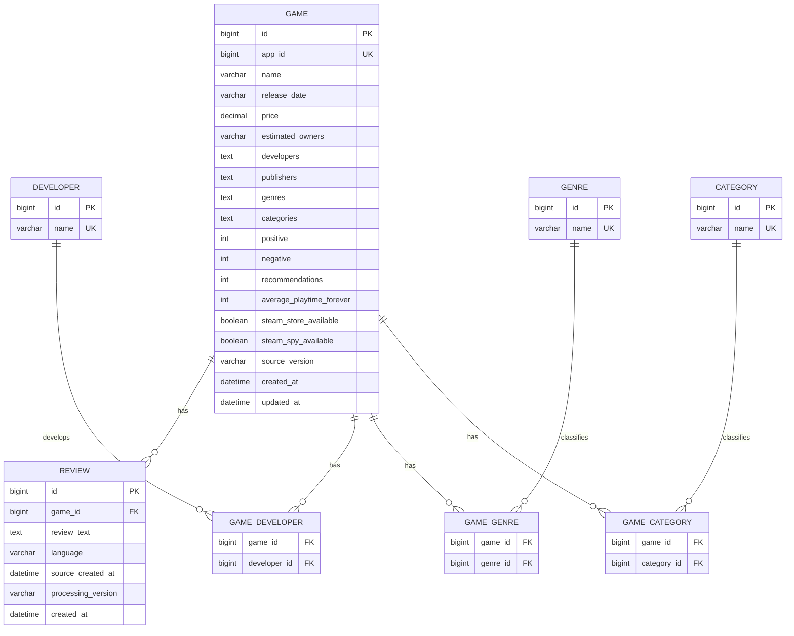
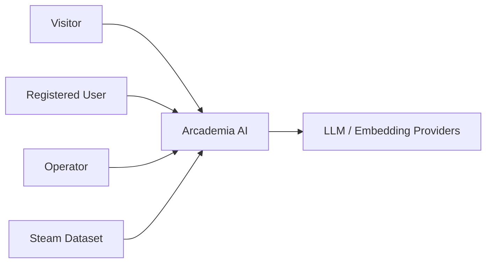
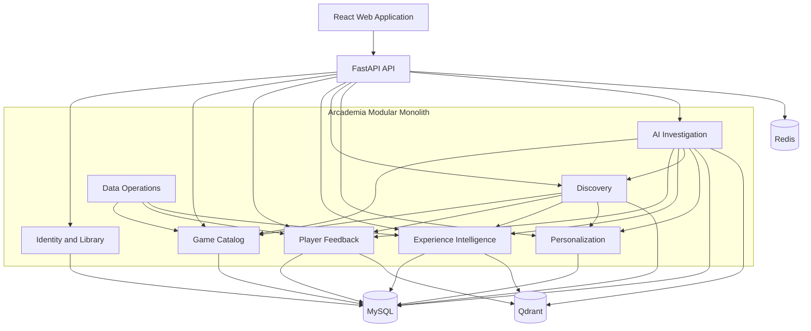
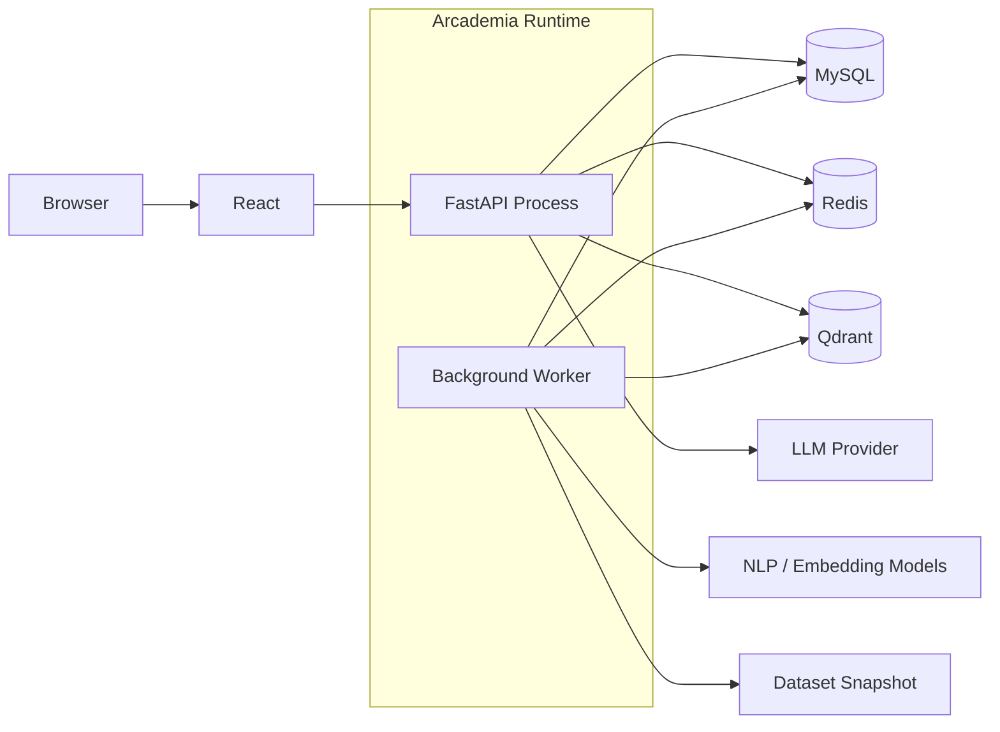
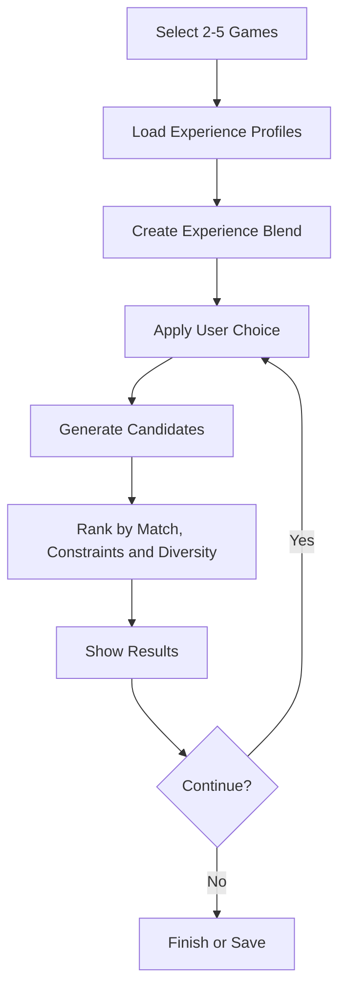
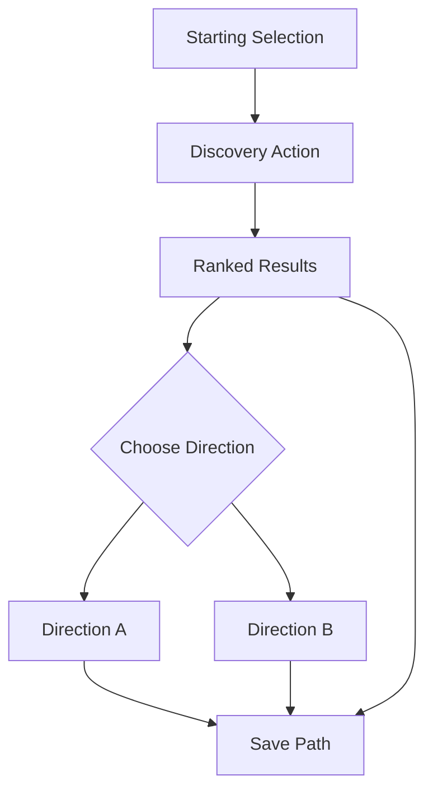
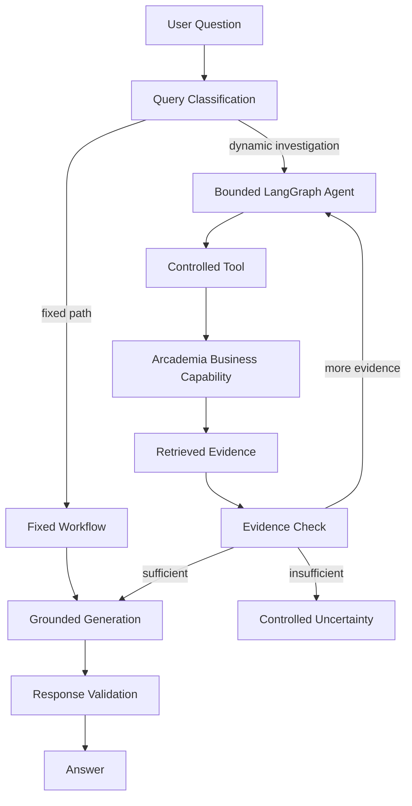
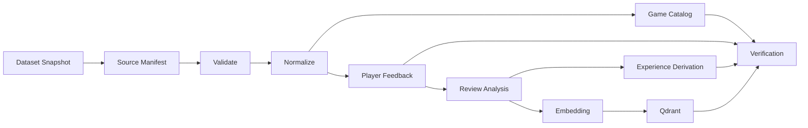
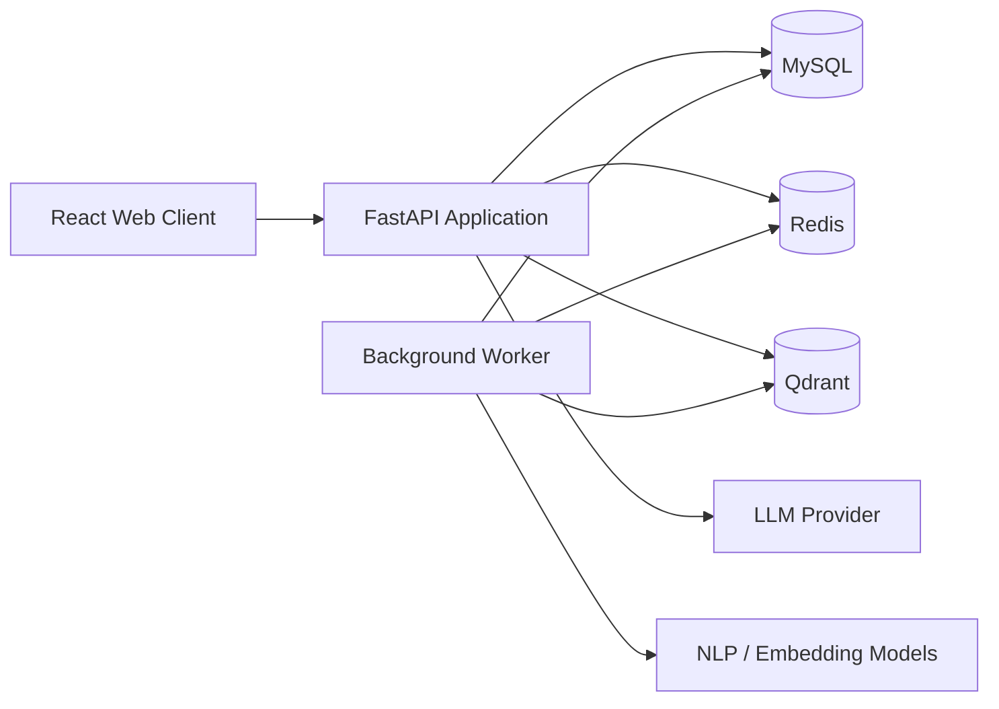

# Arcademia AI
## Software Requirements Specification (SRS)

**Document Status:** Baseline  
**Architecture:** Modular Monolith with Background Processing  
**Backend:** Python / FastAPI  
**Frontend:** React  
**Structured Database:** MySQL  
**Cache / Job Queue:** Redis  
**Vector Database:** Qdrant  
**AI Orchestration:** LangGraph  
**Primary External Data Source:** Steam Games Dataset

---

## 1. Purpose

This document specifies the functional and non-functional requirements for Arcademia AI.

It defines the system scope, users, behavior, external interfaces, data requirements, business capabilities, high-level architecture, security, reliability, testing, and acceptance criteria.

The document is the baseline for implementation and verification.

---

## 2. System Scope

Arcademia AI is a web application for game discovery and game-experience analysis.

The system uses structured game data, player reviews, derived review intelligence, semantic retrieval, deterministic ranking, and AI investigation.

The system shall provide useful discovery capabilities without requiring an external LLM for normal operation.

### 2.1 In Scope

- Game catalog and search.
- Player review storage and analysis.
- Experience Profiles.
- Deterministic similarity, matching, ranking, and novelty.
- Game comparison.
- Experience Blends using 2 to 5 games.
- Discovery Paths and the Discovery Board.
- User accounts and authentication.
- My Library and My Preferences.
- Semantic search and vector retrieval.
- Grounded AI question answering.
- Bounded LangGraph agent workflows.
- Controlled MCP integration.
- Background data processing and reprocessing.
- Testing, monitoring, evaluation, and deployment support.

### 2.2 Out of Scope

- Game purchasing or payment processing.
- Game launching or game distribution.
- Steam account integration in the initial release.
- Real-time gameplay telemetry collection.
- Public messaging or a general social network.
- A developer analytics platform as a primary capability.
- Foundation-model training from scratch.
- Multi-agent execution as the default architecture.
- Independent deployment of every business capability.

---

## 3. System Objectives

The system shall:

1. Help users find games beyond exact keyword matching.
2. Represent supported game experience characteristics in an explainable form.
3. Let users actively explore relationships between games.
4. Keep core discovery deterministic, testable, and available without an LLM.
5. Use player reviews as evidence for supported insights.
6. Provide grounded AI investigation for questions that benefit from reasoning and synthesis.
7. Keep business capabilities separated inside one modular monolith.
8. Support persistent user data without mixing it with canonical game data.
9. Remain practical for a small engineering team to build and operate.

---

## 4. Users and Roles

### 4.1 Visitor

An unauthenticated user.

A visitor shall be able to browse and search games, compare games, create temporary Blends, and use supported public discovery features.

A visitor shall not access private user data.

### 4.2 Registered User

A registered user shall additionally be able to save games, Blends, comparisons, Discovery Paths, and preferences, and access My Library and My Preferences.

### 4.3 Operator

An authorized system maintainer who may run ingestion, inspect processing status, retry failed jobs, rebuild indexes, and inspect operational health.

---

## 5. System Terminology

The following terms form the common user and domain vocabulary.

| User-facing term | Domain meaning |
|---|---|
| **Game** | Canonical game record |
| **Reviews** | Player-written reviews and related analysis |
| **Experience Profile** | Structured representation of supported game characteristics |
| **Discover** | Game search and discovery |
| **Compare** | Comparison of games and supporting evidence |
| **Blend** | A target experience created from 2 to 5 games |
| **Discovery Path** | A sequence of discovery actions and resulting states |
| **Discovery Board** | Visual view of a Discovery Path and its branches |
| **Match** | Compatibility between a game and a target |
| **My Preferences** | A user's structured preference profile |
| **Try Something New** | Novelty-aware discovery outside familiar preferences |
| **My Library** | User-owned saved games and discoveries |
| **Deep Dive** | AI-assisted multi-step investigation |
| **Evidence** | Source data supporting an insight or AI response |

Technical terms such as embedding, vector search, RAG, LangGraph, and MCP describe implementation mechanisms. They are not alternative names for business concepts.

The same business concept uses the same term across requirements, domain models, APIs, code, database models, and user-facing flows. A term is not renamed when it crosses a technical boundary unless its meaning changes. This is the project's ubiquitous language. [2]

---

## 6. Functional Requirements

### 6.1 Identity and Authentication

| ID | Requirement | Priority |
|---|---|---|
| FR-001 | The system shall allow a user to create an account using a supported authentication method. | Must |
| FR-002 | The system shall authenticate users before granting access to private data. | Must |
| FR-003 | The system shall allow authenticated users to log out. | Must |
| FR-004 | The system should support account recovery. | Should |
| FR-005 | The system shall authorize access to resources by authenticated user identity. | Must |
| FR-006 | The system shall support anonymous discovery without mandatory registration. | Must |

### 6.2 Game Catalog

| ID | Requirement | Priority |
|---|---|---|
| FR-007 | The system shall store normalized game metadata in MySQL. | Must |
| FR-008 | The system shall support structured game search. | Must |
| FR-009 | The system shall support filtering using supported game attributes. | Must |
| FR-010 | The system shall return paginated game results. | Must |
| FR-011 | The system shall provide a game details view. | Must |
| FR-012 | The system shall preserve the external source identifier for imported games. | Must |

### 6.3 Reviews

| ID | Requirement | Priority |
|---|---|---|
| FR-013 | The system shall store reviews associated with games. | Must |
| FR-014 | The system shall process review text through background jobs. | Must |
| FR-015 | The system shall store versioned review-analysis artifacts. | Must |
| FR-016 | The system shall support review-level evidence retrieval. | Must |
| FR-017 | The system shall support game-level aggregation of review signals. | Must |
| FR-018 | The system should show the freshness of derived review insights. | Should |

### 6.4 Experience Profiles

| ID | Requirement | Priority |
|---|---|---|
| FR-019 | The system shall maintain an Experience Profile for supported games. | Must |
| FR-020 | Experience Profile values shall be derived from supported structured and review signals. | Must |
| FR-021 | The system shall record the processing version used for derived experience data. | Must |
| FR-022 | The system shall expose Experience Profile data through an application interface. | Must |
| FR-023 | The system shall avoid exposing unsupported experience dimensions when evidence quality is insufficient. | Must |

### 6.5 Discovery and Search

| ID | Requirement | Priority |
|---|---|---|
| FR-024 | The system shall provide deterministic game discovery. | Must |
| FR-025 | The system shall support semantic search using natural-language queries. | Must |
| FR-026 | The system should support hybrid retrieval when exact terms and semantic meaning both matter. | Should |
| FR-027 | The system shall separate candidate generation from final ranking. | Must |
| FR-028 | The system shall rank candidates using explicit scoring rules or configured ranking algorithms. | Must |
| FR-029 | The system shall support configurable result counts. | Must |
| FR-030 | The system shall support diversity-aware ranking. | Must |
| FR-031 | The system shall provide a **Try Something New** discovery mode. | Must |

### 6.6 Compare

| ID | Requirement | Priority |
|---|---|---|
| FR-032 | The system shall allow users to compare supported games. | Must |
| FR-033 | A comparison shall contain structured differences between the selected games. | Must |
| FR-034 | A comparison should include relevant review evidence where available. | Should |
| FR-035 | The system shall report differences and trade-offs rather than an objective overall winner. | Must |

### 6.7 Blend

| ID | Requirement | Priority |
|---|---|---|
| FR-036 | The system shall allow selection of 2 to 5 games for a Blend. | Must |
| FR-037 | The system shall calculate a target experience from the selected games. | Must |
| FR-038 | The system shall support user-controlled experience transformations. | Must |
| FR-039 | Transformations shall affect only supported experience dimensions. | Must |
| FR-040 | The system shall return ranked games matching the resulting target. | Must |
| FR-041 | The system shall allow a user to continue discovery from Blend results. | Must |

### 6.8 Discovery Path and Discovery Board

| ID | Requirement | Priority |
|---|---|---|
| FR-042 | The system shall record important discovery actions within a Discovery Path. | Must |
| FR-043 | The system shall support branching from an earlier discovery state. | Must |
| FR-044 | The system shall allow authenticated users to save a Discovery Path. | Must |
| FR-045 | The system shall allow authenticated users to reopen a saved Discovery Path. | Must |
| FR-046 | The system shall provide a Discovery Board for an active or saved path. | Must |
| FR-047 | The system shall allow users to return to an earlier discovery state. | Must |
| FR-048 | The system should support sharing of permitted Discovery Paths. | Should |

### 6.9 Personalization and My Preferences

| ID | Requirement | Priority |
|---|---|---|
| FR-049 | The system shall maintain a structured My Preferences profile for authenticated users. | Must |
| FR-050 | The system shall support explicit preference signals. | Must |
| FR-051 | The system shall support permitted behavioral preference signals. | Must |
| FR-052 | The system shall distinguish explicit preferences from inferred preferences. | Must |
| FR-053 | Explicit user choices shall be able to override inferred preferences where appropriate. | Must |
| FR-054 | The system shall use My Preferences in supported personalized discovery operations. | Must |

### 6.10 My Library

| ID | Requirement | Priority |
|---|---|---|
| FR-055 | The system shall allow authenticated users to save games. | Must |
| FR-056 | The system shall allow users to remove saved items. | Must |
| FR-057 | The system shall store saved Blends and Discovery Paths independently of canonical game data. | Must |
| FR-058 | The system shall provide saved items through My Library. | Must |

### 6.11 Deep Dive and AI Investigation

| ID | Requirement | Priority |
|---|---|---|
| FR-059 | The system shall support grounded answers to supported open-ended game questions. | Must |
| FR-060 | Application-specific factual AI answers shall use retrieved Arcademia data. | Must |
| FR-061 | The system shall provide evidence references where source attribution is available. | Must |
| FR-062 | AI workflows shall access business capabilities only through explicit tools or application interfaces. | Must |
| FR-063 | The agent shall not access MySQL, Qdrant, shell commands, or arbitrary HTTP directly. | Must |
| FR-064 | The system shall support bounded LangGraph workflows for dynamic multi-step investigation. | Must |
| FR-065 | AI runs shall stop at configured step, time, and token limits where measurable. | Must |
| FR-066 | The system shall return a controlled response when required evidence is unavailable. | Must |
| FR-067 | The system should support selected MCP integrations without bypassing authorization. | Should |

### 6.12 Data Operations

| ID | Requirement | Priority |
|---|---|---|
| FR-068 | The system shall ingest supported dataset files through a repeatable pipeline. | Must |
| FR-069 | The pipeline shall validate required fields before canonical persistence. | Must |
| FR-070 | Invalid records shall be isolated from valid records. | Must |
| FR-071 | The pipeline shall be safe to rerun for the same source snapshot. | Must |
| FR-072 | The system shall record source and processing metadata for ingestion runs. | Must |
| FR-073 | The pipeline shall support incremental processing when changes can be identified. | Must |
| FR-074 | Failed processing records shall be retryable or quarantinable. | Must |
| FR-075 | The system shall update or rebuild vector indexes from authoritative and derived data. | Must |

### 6.13 Operations

| ID | Requirement | Priority |
|---|---|---|
| FR-076 | The system shall expose an application health endpoint. | Must |
| FR-077 | Authorized operators should be able to inspect background-job status. | Should |
| FR-078 | Each incoming request shall receive a request identifier. | Must |
| FR-079 | Each AI execution shall receive an AI run identifier. | Must |
| FR-080 | The system shall record structured telemetry for important application, data, retrieval, and AI operations. | Must |

---

## 7. External Interfaces

### 7.1 Web Application

The React client shall provide the primary interface for visitors and registered users.

Primary navigation shall use:

- Discover
- Compare
- Blend
- My Library
- My Preferences
- Deep Dive

### 7.2 REST API

The web client shall communicate with the backend through REST APIs.

The API shall use:

- HTTPS in hosted environments;
- JSON requests and responses;
- request validation;
- pagination for large collections;
- authentication for protected resources;
- authorization for user-owned resources;
- structured errors;
- request identifiers.

### 7.3 Dataset Interface

The ingestion pipeline shall accept the supported Steam dataset files.

CSV/source files shall not be read directly by normal user requests.

### 7.4 Authentication Interface

Authentication shall be exposed to the application through an identity abstraction so the application is not tied to a specific provider.

### 7.5 Model Interface

LLM and embedding providers shall be accessed through provider adapters.

### 7.6 MCP Interface

When enabled, MCP shall expose only selected, authorized capabilities.

---

## 8. Data Requirements

### 8.1 Source Data

The initial source is the Steam Games Dataset maintained on Kaggle. The source is treated as external, versioned input. [3]

The source may change between snapshots, therefore ingestion records the source reference and processing state.

The ingestion layer preserves the source field names from the supplied dataset. The initial `steam_games.csv` fields used by Arcademia are:

| Source field | Meaning in Arcademia |
|---|---|
| `app_id` | Steam application identifier |
| `name` | Game name |
| `release_date` | Game release date |
| `price` | Game price |
| `estimated_owners` | Estimated owner range |
| `developers` | Developer information |
| `publishers` | Publisher information |
| `genres` | Genre information |
| `categories` | Category information |
| `positive` | Positive review count |
| `negative` | Negative review count |
| `recommendations` | Recommendation count |
| `average_playtime_forever` | Average lifetime playtime |
| `steam_store_available` | Steam Store availability indicator |
| `steam_spy_available` | Steam Spy availability indicator |

The review source preserves the supplied review-file structure, including `app_id` and the review payload. Source fields are not renamed during ingestion merely for stylistic consistency. Internal derived fields are stored separately from source fields.

### 8.2 Canonical Data

MySQL shall be authoritative for relational game and review data.

Initial logical entities:

- Game
- Developer
- Publisher
- Genre
- Category
- Review

### 8.3 Derived Data

Derived data may include:

- review sentiment;
- review topics;
- entity information where justified;
- review embeddings;
- Experience Profiles;
- experience aggregates;
- recommendation/ranking artifacts.

Derived records shall retain source and processing-version information needed for regeneration or diagnosis.

### 8.4 User Data

User data may include:

- account identity;
- saved games;
- favourites;
- My Preferences;
- explicit preferences;
- behavioral preference signals;
- saved comparisons;
- saved Blends;
- Discovery Paths;
- sharing metadata.

User data shall not modify canonical game or review records.

### 8.5 AI Run Data

An AI run may record:

- run ID;
- request ID;
- workflow;
- model identifier;
- prompt version;
- tool calls;
- evidence identifiers;
- token usage where available;
- validation result;
- termination reason.

Raw hidden chain-of-thought shall not be stored as application data.

---

## 9. Logical Data Model


```mermaid
erDiagram
    GAME ||--o{ REVIEW : has
    GAME ||--o{ GAME_DEVELOPER : has
    DEVELOPER ||--o{ GAME_DEVELOPER : develops
    GAME ||--o{ GAME_GENRE : has
    GENRE ||--o{ GAME_GENRE : classifies
    GAME ||--o{ GAME_CATEGORY : has
    CATEGORY ||--o{ GAME_CATEGORY : classifies

    GAME {
        bigint id PK
        bigint app_id UK
        varchar name
        varchar release_date
        decimal price
        varchar estimated_owners
        text developers
        text publishers
        text genres
        text categories
        int positive
        int negative
        int recommendations
        int average_playtime_forever
        boolean steam_store_available
        boolean steam_spy_available
        varchar source_version
        datetime created_at
        datetime updated_at
    }

    REVIEW {
        bigint id PK
        bigint game_id FK
        text review_text
        varchar language
        datetime source_created_at
        varchar processing_version
        datetime created_at
    }

    DEVELOPER {
        bigint id PK
        varchar name UK
    }

    GENRE {
        bigint id PK
        varchar name UK
    }

    CATEGORY {
        bigint id PK
        varchar name UK
    }

    GAME_DEVELOPER {
        bigint game_id FK
        bigint developer_id FK
    }

    GAME_GENRE {
        bigint game_id FK
        bigint genre_id FK
    }

    GAME_CATEGORY {
        bigint game_id FK
        bigint category_id FK
    }
```

The physical schema shall be finalized from verified source fields and measured query patterns.

---

## 10. Business Capability Boundaries

Arcademia shall use business capabilities as its main application module boundaries.

### 10.1 Game Catalog

Owns canonical game information and structured game search.

### 10.2 Player Feedback

Owns reviews and review-derived intelligence.

### 10.3 Experience Intelligence

Owns Experience Profiles and deterministic experience calculations.

### 10.4 Discovery

Owns candidate generation, ranking, similarity, novelty, Blends, Discovery Paths, and Discovery Board state.

### 10.5 Personalization

Owns My Preferences and user preference signals.

### 10.6 Identity and Library

Owns application identity and saved user content.

### 10.7 AI Investigation

Owns AI workflows, retrieval orchestration, tool use, AI run state, and grounded response assembly.

### 10.8 Data Operations

Owns source ingestion, validation, processing jobs, manifests, and reprocessing.

These are in-process modules inside one application. They are not separately deployed services.

---

## 11. Module Dependency Rules

1. A module may call another module only through its public application interface.
2. A module shall not access another module's repository or private database model.
3. A module shall not execute SQL against another module's private tables.
4. Domain logic shall not depend directly on FastAPI, Qdrant, Redis, or an LLM SDK.
5. Generic technical utilities may be shared when they contain no business rules.
6. In-process calls are preferred for request-critical operations requiring immediate consistency.
7. Background jobs may use the same modules but are separate runtime processes where needed.

---

## 12. High-Level Architecture

### 12.1 System Context


```mermaid
flowchart LR
    Visitor[Visitor]
    User[Registered User]
    Operator[Operator]
    Dataset[Steam Dataset]
    Models[LLM / Embedding Providers]
    Arcademia[Arcademia AI]

    Visitor --> Arcademia
    User --> Arcademia
    Operator --> Arcademia
    Dataset --> Arcademia
    Arcademia --> Models
```

### 12.2 Logical Architecture


```mermaid
flowchart TB
    Web[React Web Application]
    API[FastAPI API]

    subgraph App[Arcademia Modular Monolith]
        Identity[Identity and Library]
        Catalog[Game Catalog]
        Feedback[Player Feedback]
        Experience[Experience Intelligence]
        Discovery[Discovery]
        Personalization[Personalization]
        AI[AI Investigation]
        DataOps[Data Operations]
    end

    Web --> API
    API --> Identity
    API --> Catalog
    API --> Feedback
    API --> Experience
    API --> Discovery
    API --> Personalization
    API --> AI

    Discovery --> Catalog
    Discovery --> Feedback
    Discovery --> Experience
    Discovery --> Personalization

    AI --> Catalog
    AI --> Feedback
    AI --> Experience
    AI --> Discovery
    AI --> Personalization

    DataOps --> Catalog
    DataOps --> Feedback
    DataOps --> Experience

    Catalog --> MySQL[(MySQL)]
    Feedback --> MySQL
    Experience --> MySQL
    Discovery --> MySQL
    Personalization --> MySQL
    Identity --> MySQL
    AI --> MySQL

    Feedback --> Qdrant[(Qdrant)]
    Experience --> Qdrant
    AI --> Qdrant
    API --> Redis[(Redis)]
```

Internal business modules communicate in-process. Network boundaries are reserved for the client and external infrastructure.

### 12.3 Runtime Topology


```mermaid
flowchart LR
    Browser[Browser] --> Web[React]
    Web --> API[FastAPI Process]

    subgraph Runtime[Arcademia Runtime]
        API
        Worker[Background Worker]
    end

    API --> DB[(MySQL)]
    API --> Cache[(Redis)]
    API --> Vector[(Qdrant)]
    API --> LLM[LLM Provider]

    Worker --> DB
    Worker --> Cache
    Worker --> Vector
    Worker --> Models[NLP / Embedding Models]
    Worker --> Source[Dataset Snapshot]
```

The worker is a runtime role, not a business service boundary.

---

## 13. Experience and Discovery Requirements

### 13.1 Experience Profile

An Experience Profile shall contain only dimensions supported by reliable data and evaluation.

Potential dimensions include:

- story;
- character depth;
- exploration;
- combat;
- difficulty;
- progression;
- grind;
- freedom;
- player choice;
- replayability;
- session commitment;
- multiplayer dependence.

The final dimension set shall be based on data quality and evaluation results.

### 13.2 Match Calculation

A Match shall be computed from explicit experience signals and user constraints.

The underlying score shall be deterministic and independently testable.

### 13.3 Ranking

Ranking may consider:

```text
Experience Match
+ User Preference Match
+ Required Constraints
+ Diversity
+ Novelty
```

Weights shall be configurable and evaluated. No score shall be presented as an objective measure of game quality.

### 13.4 Blend


```mermaid
flowchart TD
    Select[Select 2-5 Games]
    Profiles[Load Experience Profiles]
    Blend[Create Experience Blend]
    Transform[Apply User Choice]
    Candidates[Generate Candidates]
    Rank[Rank by Match, Constraints and Diversity]
    Results[Show Results]
    Continue{Continue?}

    Select --> Profiles --> Blend --> Transform --> Candidates --> Rank --> Results
    Results --> Continue
    Continue -->|Yes| Transform
    Continue -->|No| End[Finish or Save]
```

### 13.5 Discovery Path


```mermaid
flowchart TD
    Root[Starting Selection]
    Action[Discovery Action]
    Results[Ranked Results]
    Branch{Choose Direction}
    A[Direction A]
    B[Direction B]
    Save[Save Path]

    Root --> Action --> Results --> Branch
    Branch --> A --> Save
    Branch --> B --> Save
    Results --> Save
```

The interface shall preserve the current state and allow return to an earlier state.

---

## 14. Search and Retrieval

### 14.1 Structured Search

Structured search shall use indexed relational fields and parameterized queries.

Supported filters may include:

- name;
- developer;
- publisher;
- genre;
- category;
- price;
- release date;
- review counts;
- recommendations;
- playtime.

### 14.2 Semantic Search

Semantic search shall:

1. process the query;
2. create a query embedding;
3. retrieve candidate vectors;
4. apply supported metadata filters;
5. return ranked results with source identifiers.

Similarity thresholds shall be calibrated using evaluation data.

### 14.3 Hybrid Retrieval

Hybrid retrieval may combine lexical and semantic retrieval where this improves search quality.

It shall become the default only if evaluation supports that choice.

### 14.4 Reranking

Reranking is optional and shall be added only when first-stage retrieval quality is insufficient and the latency cost is acceptable.

---

## 15. AI Investigation Architecture

### 15.1 Execution Rule

The system shall choose the simplest execution pattern that satisfies the request.

```text
Deterministic logic
        |
        v
Fixed workflow
        |
        v
Bounded single agent
        |
        v
Multi-agent only when justified
```

### 15.2 AI Request Flow


```mermaid
flowchart TD
    Query[User Question]
    Classify[Query Classification]
    Fixed[Fixed Workflow]
    Agent[Bounded LangGraph Agent]
    Tool[Controlled Tool]
    Capability[Arcademia Business Capability]
    Evidence[Retrieved Evidence]
    Check[Evidence Check]
    Generate[Grounded Generation]
    Validate[Response Validation]
    Answer[Answer]
    Abstain[Controlled Uncertainty]

    Query --> Classify
    Classify -->|fixed path| Fixed --> Generate
    Classify -->|dynamic investigation| Agent --> Tool --> Capability --> Evidence --> Check
    Check -->|more evidence| Agent
    Check -->|sufficient| Generate --> Validate --> Answer
    Check -->|insufficient| Abstain
```

### 15.3 RAG

For application-specific factual questions, retrieval shall occur before generation.

The context builder shall control:

- evidence count;
- source diversity;
- duplicate removal;
- metadata filters;
- context size;
- source identifiers.

Retrieved content shall be treated as untrusted data and shall not override system policies.

### 15.4 Tools

Initial read-only tools may include:

- `game_lookup`
- `game_search`
- `semantic_search`
- `review_search`
- `review_insights`
- `recommend_games`
- `compare_games`
- `experience_profile`
- `blend_games`

A tool shall define a stable name, input schema, output schema, failure behavior, and authorization class.

The agent shall not receive generic SQL, shell, or arbitrary HTTP tools.

### 15.5 Agent State

AI state may contain:

- request ID;
- run ID;
- user query;
- intent;
- identified games;
- workflow;
- retrieved evidence identifiers;
- tool results;
- step count;
- termination reason.

State shall be bounded to the task.

### 15.6 MCP

MCP shall be treated as an interoperability layer. It shall not replace internal module boundaries or authorization rules.

---

## 16. Data Ingestion and Processing

### 16.1 Processing Pipeline


```mermaid
flowchart LR
    Source[Dataset Snapshot]
    Manifest[Source Manifest]
    Validate[Validate]
    Normalize[Normalize]
    Catalog[Game Catalog]
    Reviews[Player Feedback]
    Analyze[Review Analysis]
    Embed[Embedding]
    Experience[Experience Derivation]
    Vector[Qdrant]
    Verify[Verification]

    Source --> Manifest --> Validate --> Normalize
    Normalize --> Catalog
    Normalize --> Reviews
    Reviews --> Analyze --> Experience
    Analyze --> Embed --> Vector
    Catalog --> Verify
    Reviews --> Verify
    Experience --> Verify
    Vector --> Verify
```

### 16.2 Stages

1. Discover source files and source reference.
2. Validate structure and required fields.
3. Normalize source records.
4. Persist canonical game and review data.
5. Analyze changed/new reviews.
6. Generate embeddings for approved indexed content.
7. Derive or update Experience Profiles.
8. Update vector indexes.
9. Verify processing results.
10. Record the processing manifest.

### 16.3 Incremental Processing

The system shall compare stable game identifiers and suitable row hashes.

Where a stable review identifier is unavailable, the system shall use a suitable content fingerprint from available review fields.

A source snapshot change shall not automatically require full reprocessing.

### 16.4 Failed Records

Failed records shall retain:

- source identifier;
- processing stage;
- failure category;
- processing run ID;
- retry status.

### 16.5 Snapshot Activation

A new source snapshot shall not become the active data set until required validation checks succeed.

---

## 17. Authentication, User Data, and Sharing

### 17.1 Account Flow

```text
Visit Arcademia
      |
      v
Explore without account
      |
      v
Create something worth saving
      |
      v
Sign up / Log in
      |
      v
My Library + My Preferences
```

### 17.2 User Data Rules

- User data shall be separated from canonical game data.
- Explicit preferences shall be distinguishable from inferred preferences.
- User preferences shall be structured rather than stored as one opaque AI-generated description.
- A user's explicit choice shall be able to override inferred behavior.

### 17.3 Sharing

A shared Discovery Path shall expose only information intended for public access.

Private identity or private preference data shall not be exposed through a shared link.

---

## 18. Security and Privacy

### 18.1 Authentication and Authorization

Protected resources shall require authentication.

Authorization shall be enforced by deterministic application code.

The LLM shall never make the final authorization decision.

### 18.2 Untrusted Inputs

The following shall be treated as untrusted:

- user prompts;
- player review text;
- retrieved content;
- model-generated tool arguments;
- external tool responses;
- MCP content.

### 18.3 AI Controls

The system shall use:

- strict tool schemas;
- least-privilege tools;
- input validation;
- output validation;
- prompt-injection defenses;
- rate limits;
- authorization outside the model.

### 18.4 Secrets

API keys, passwords, tokens, and deployment secrets shall not be committed to source control.

### 18.5 Privacy

The system shall collect only data required for supported features.

Behavioral data used for personalization shall have documented purpose and retention rules.

---

## 19. Reliability and Failure Handling

| Condition | Required behavior |
|---|---|
| MySQL transient failure | Bounded retry, then controlled failure |
| Redis unavailable | Continue without cache where safe |
| Qdrant unavailable | Use structured retrieval where sufficient; otherwise report degraded semantic capability |
| LLM unavailable | Core discovery continues; Deep Dive reports controlled unavailability |
| Invalid model output | Validate, retry within policy, or fail safely |
| Agent budget exceeded | Stop execution and return controlled result |
| Insufficient evidence | Qualify or abstain; do not invent facts |
| Invalid dataset record | Quarantine and continue valid records |
| Worker failure | Leave job retryable or mark for recovery |

External calls shall have timeouts. Retries shall be bounded and used only where appropriate.

---

## 20. Performance and Cost Requirements

### 20.1 Interactive Requests

Interactive requests shall avoid:

- full-dataset scans;
- repeated NLP inference;
- synchronous bulk processing;
- unbounded agent loops;
- unnecessary sequential model calls.

### 20.2 Database

The system shall use indexed lookup fields, foreign-key indexes where needed, parameterized queries, and paginated access for large result sets.

### 20.3 Vector Retrieval

Vector retrieval shall be evaluated for latency, recall, filtering behavior, and memory use.

### 20.4 LLM Cost

The core discovery path shall not require a per-request external LLM call.

LLM usage shall be limited through deterministic routing, bounded contexts, selective retrieval, caching where justified, and optional model routing.

The system shall record token usage and estimated cost where the provider exposes the required information.

---

## 21. Caching and Background Work

### 21.1 Redis

Redis may be used for:

- cached game lookups;
- expensive deterministic discovery results;
- suitable retrieval results;
- rate-limit state;
- background job coordination.

Redis shall not be the authoritative store for business data.

### 21.2 Background Jobs

Background jobs shall handle:

- dataset ingestion;
- review analysis;
- embeddings;
- Experience Profile derivation;
- vector index rebuilds;
- bulk reprocessing;
- large evaluation jobs.

Jobs shall be identifiable, retryable where safe, and observable.

---

## 22. Observability

Each request shall have a request ID.

Each AI execution shall have an AI run ID.

Each background job shall have a job or processing-run ID.

Important telemetry shall include:

- request count;
- error rate;
- latency;
- database latency;
- cache hit rate;
- retrieval latency;
- retrieval result quality metrics;
- agent step count;
- tool success rate;
- model latency;
- token usage where available;
- data-processing throughput and failures.

Logs shall not contain secrets, passwords, API keys, or unnecessary full user conversations.

---

## 23. Testing and Evaluation

### 23.1 Unit Tests

Unit tests shall cover deterministic logic including:

- filtering;
- similarity;
- Match calculation;
- ranking;
- diversity;
- novelty;
- Blend calculations;
- preference updates;
- validation;
- authorization rules.

### 23.2 Integration Tests

Integration tests shall cover:

- MySQL;
- Redis;
- Qdrant;
- authentication;
- module interfaces;
- background jobs;
- API flows.

### 23.3 AI Evaluation

A curated evaluation set shall cover:

- semantic search;
- recommendations;
- comparisons;
- review questions;
- insufficient-evidence cases;
- multi-step questions;
- adversarial prompts;
- multi-turn cases.

Retrieval shall be evaluated separately from generation.

Agent evaluation shall include tool selection, valid tool arguments, correct termination, evidence use, unsupported-claim rate, latency, and token usage.

### 23.4 Regression

Changes to models, prompts, embeddings, retrieval configuration, tools, agent workflows, or processing versions shall trigger relevant regression tests.

### 23.5 End-to-End

End-to-end tests shall cover:

- registration and login;
- search;
- comparison;
- Blend;
- Discovery Path;
- saving to My Library;
- My Preferences updates;
- semantic search;
- Deep Dive;
- dependency failure behavior.

---

## 24. Deployment Requirements

### 24.1 Initial Topology


```mermaid
flowchart LR
    Client[React Web Client] --> API[FastAPI Application]

    API --> DB[(MySQL)]
    API --> Cache[(Redis)]
    API --> Vector[(Qdrant)]
    API --> LLM[LLM Provider]

    Worker[Background Worker] --> DB
    Worker --> Cache
    Worker --> Vector
    Worker --> NLP[NLP / Embedding Models]
```

### 24.2 Containerization

Docker shall be used for reproducible local development and deployment packaging.

Containers shall follow runtime roles rather than business capabilities.

### 24.3 Environment Separation

At minimum, the system shall support:

- local development;
- test/CI;
- hosted production or demonstration.

Environment-specific configuration shall be externalized.

### 24.4 Scaling

API and worker processes shall be scalable independently.

The system shall not introduce microservices solely to obtain this process-level scaling.

---

## 25. Constraints and Assumptions

### 25.1 Constraints

- Small engineering team.
- Modular monolith architecture.
- One primary external data source initially.
- Deterministic discovery core.
- Background processing for expensive work.
- Replaceable AI providers.
- No real-time gameplay telemetry requirement.

### 25.2 Assumptions

- The selected dataset remains technically accessible.
- Dataset license and redistribution terms are verified before public release.
- Source data requires validation and normalization.
- Exact models, weights, and retrieval thresholds are selected using evaluation evidence.
- The initial workload fits a small deployment with separate API and worker processes.

---

## 26. Architecture Decisions

### ADR-001: Modular Monolith

**Decision:** Use a modular monolith.  
**Reason:** The system has one application boundary and a small engineering team. Independent service deployment is not currently justified.

### ADR-002: Business-Capability Boundaries

**Decision:** Organize modules around business capabilities.  
**Reason:** Business capabilities provide clearer ownership and change boundaries than technical layers such as API, NLP, or database services.

### ADR-003: Deterministic Discovery Core

**Decision:** Discovery, matching, ranking, Blend, and personalization shall not require an LLM.  
**Reason:** This reduces cost, improves predictability, supports testing, and keeps core functionality available during model-provider failures.

### ADR-004: Bounded Single Agent

**Decision:** Use a bounded single agent for dynamic AI investigation.  
**Reason:** Multi-agent coordination is not currently required and would add unnecessary complexity.

### ADR-005: Offline Enrichment

**Decision:** Review analysis, embeddings, and bulk Experience Profile computation shall run as background work.  
**Reason:** These operations are compute-heavy and should not block interactive requests.

### ADR-006: Provider Adapters

**Decision:** LLM and embedding providers shall be accessed through adapters.  
**Reason:** This keeps provider-specific behavior outside business logic and supports replacement.

### ADR-007: MCP as Interoperability

**Decision:** MCP is the interoperability boundary for capabilities that Arcademia exposes to compatible AI clients or external tools.  
**Reason:** Internal tool calling remains application-defined. MCP provides an external interoperability contract without changing domain module boundaries.

### ADR-008: Authentication with Anonymous Entry

**Decision:** Authentication is part of the initial system, but anonymous exploration remains supported.  
**Reason:** Persistent features need identity, while mandatory registration before first use adds unnecessary friction.

---

## 27. Acceptance Criteria

The system is ready for initial public deployment when:

1. A visitor can search and discover games without an account.
2. A visitor can compare games and create a temporary Blend.
3. A user can register, authenticate, and access private data.
4. A user can save games and discoveries in My Library.
5. A user can create and transform a Blend using 2 to 5 games.
6. Blend results are generated through deterministic ranking.
7. A user can create, branch, reopen, and navigate a Discovery Path.
8. A Discovery Board represents the saved or active path.
9. My Preferences uses supported explicit and behavioral signals.
10. Semantic search works against the indexed corpus.
11. Review-derived insights are available for supported games.
12. Deep Dive can execute a bounded multi-step AI investigation using controlled tools.
13. AI answers requiring application facts use retrieved evidence.
14. The deterministic core continues to function when the LLM provider is unavailable.
15. Ingestion and enrichment are rerunnable and observable.
16. Core deterministic logic and critical user flows have automated tests.
17. User authorization protects private data.
18. Operational health and failure telemetry are available.
19. Source licensing and redistribution requirements have been reviewed before public deployment.

---

## 28. Future Evolution

Future capabilities may include:

- additional game data sources;
- richer personalization;
- learned ranking;
- temporal review analysis;
- stronger experience modeling;
- additional MCP integrations;
- additional AI workflows;
- extraction of a bounded module into a service when independently scaling or deploying it becomes necessary.

Future technology shall be introduced only when a requirement or measured result justifies it.

---

## 29. References

**[1] Requirements Engineering**  
ISO/IEC/IEEE 29148:2018, *Systems and software engineering - Life cycle processes - Requirements engineering*.  
https://www.iso.org/standard/72089.html

**[2] Usability**  
Nielsen Norman Group, *10 Usability Heuristics for User Interface Design*.  
https://www.nngroup.com/articles/ten-usability-heuristics/

**[3] Data Source**  
Steam Games Dataset, Kaggle.  
https://www.kaggle.com/datasets/hubertsidorowicz/steam-games-dataset-daily-updates

**[4] AI Orchestration**  
LangGraph documentation.  
https://langchain-ai.github.io/langgraph/reference/

**[5] AI Security**  
OWASP GenAI Security Project, *Top 10 for Agentic Applications*.  
https://genai.owasp.org/resource/owasp-top-10-for-agentic-applications-for-2026/

**[6] AI Risk Management**  
NIST, *Artificial Intelligence Risk Management Framework: Generative Artificial Intelligence Profile*.  
https://www.nist.gov/publications/artificial-intelligence-risk-management-framework-generative-artificial-intelligence

**[7] Tool Interoperability**  
Model Context Protocol.  
https://modelcontextprotocol.io/

**[8] Vector Retrieval**  
Qdrant documentation.  
https://qdrant.tech/documentation/

---

## 30. Requirements Change Rules

Changes to this baseline shall follow these rules:

- Mandatory behavior uses **shall**.
- Recommended behavior uses **should**.
- Requirements shall be testable and stated in clear language.
- New business modules shall be justified by a business capability.
- Technical libraries shall not define business boundaries.
- New AI autonomy shall require a documented need.
- Architecture changes shall record the decision, reason, and trigger for reconsideration.
- User-facing terminology shall remain consistent unless a deliberate terminology decision changes it.
